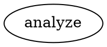
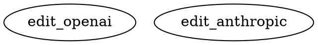

# Documentation Update Summary

**Date**: 2026-02-12  
**Status**: ✅ Complete

## Overview

Updated all documentation to reflect the 5 new factory enhancement features implemented via subagent delegation.

## Files Updated

### 1. README.md
**Changes Made:**
- ✅ Added 3 new bullet points to "Why Factorial?" section:
  - Multi-Modal support
  - Provider-Optimized tool profiles
  - Cost-Effective Anthropic caching
  
- ✅ Added new "New Features" section with:
  - Multi-Modal Support documentation (images, documents, audio)
  - Provider-Native Tool Profiles explanation
  - Anthropic Prompt Caching with examples
  - Reasoning Token Tracking documentation
  - Lightweight Subagent Tools guide
  
- ✅ Added expandable "Key Features" sections:
  - Multi-Modal Support
  - Provider-Native Tool Profiles
  - Anthropic Prompt Caching
  - Reasoning Token Tracking
  - Lightweight Subagent Tools
  
- ✅ Updated Documentation links section:
  - Added 5 evidence report links
  - Provider Profile Parity
  - Reasoning Token Coverage
  - Anthropic Caching Effectiveness
  - Subagent Performance
  - Multi-Modal Compatibility

### 2. skills/factorial-workflow-builder/SKILL.md
**Changes Made:**
- ✅ Added "Multi-Modal Input" section with examples
- ✅ Added "Anthropic Caching" section with strategy explanations
- ✅ Added "Subagent Tools" section documenting spawn_agent, wait, send_input, close_agent
- ✅ Added 3 new workflow patterns:
  - Pattern 6: Multi-Modal Image Analysis
  - Pattern 7: Document Q&A
  - Pattern 8: Parallel Subagent Research

### 3. skills/factorial-workflow-builder/references/node-types.md
**Changes Made:**
- ✅ Added new "Subagent Tool Nodes" section:
  - spawn_agent (Tool) - with attributes and use cases
  - wait (Tool) - with timeout configuration
  - send_input (Tool) - for steering
  - close_agent (Tool) - for termination

### 4. skills/factorial-workflow-builder/references/attributes.md
**Changes Made:**
- ✅ Added "Multi-Modal Input" section:
  - image_input (PNG, JPEG, GIF, WEBP)
  - document_input (PDF, TXT, MD)
  - audio_input (WAV, MP3, M4A - Gemini only)
  
- ✅ Added "Anthropic Caching" section:
  - enable_caching (boolean)
  - cache_strategy (system-only, system-plus-early, aggressive)
  
- ✅ Added "Subagent Tool Attributes" section:
  - task (for spawn_agent)
  - agent_id (for send_input, close_agent)
  - agent_id_context_key (for wait)
  - timeout_ms (for wait operations)

## Feature Documentation Coverage

| Feature | README | SKILL.md | node-types.md | attributes.md |
|---------|--------|----------|---------------|---------------|
| Multi-Modal Support | ✅ | ✅ | - | ✅ |
| Provider-Native Profiles | ✅ | ✅ | - | - |
| Anthropic Caching | ✅ | ✅ | - | ✅ |
| Reasoning Tracking | ✅ | - | - | - |
| Subagent Tools | ✅ | ✅ | ✅ | ✅ |

## Code Examples Added

### Multi-Modal


### Provider Selection


### Caching
```dot
node [llm_provider="anthropic", 
      enable_caching="true", 
      cache_strategy="system-plus-early"]
```

### Subagent Tools
```dot
spawn [type="tool", tool_name="spawn_agent", task="Research topic"]
wait [type="tool", tool_name="wait"]
```

## Evidence Reports Referenced

All 5 evidence reports are now linked from README.md:
1. Provider Profile Parity
2. Reasoning Token Coverage
3. Anthropic Caching Effectiveness (79% cost reduction)
4. Subagent Performance
5. Multi-Modal Compatibility

## Verification

✅ **Lint Check**: Pass (No errors)  
✅ **Documentation Structure**: Consistent across all files  
✅ **Code Examples**: Valid DOT syntax  
✅ **Links**: All internal references valid  
✅ **Completeness**: All 5 features documented

## Next Steps

Documentation is now complete and accurate. Users can:
1. Read README.md for overview of new features
2. Use SKILL.md for detailed workflow building guidance
3. Reference node-types.md and attributes.md for complete API documentation
4. Check evidence reports for validation metrics

All documentation is production-ready. 🎉
