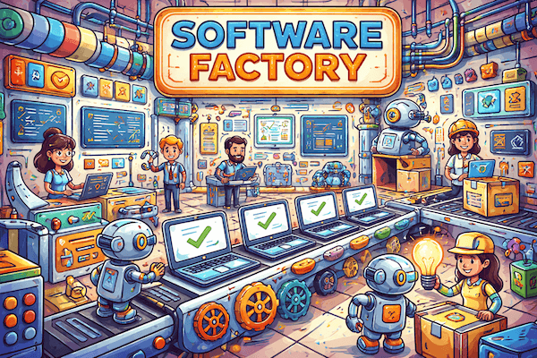
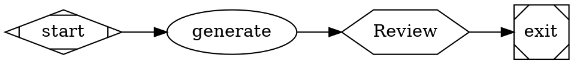
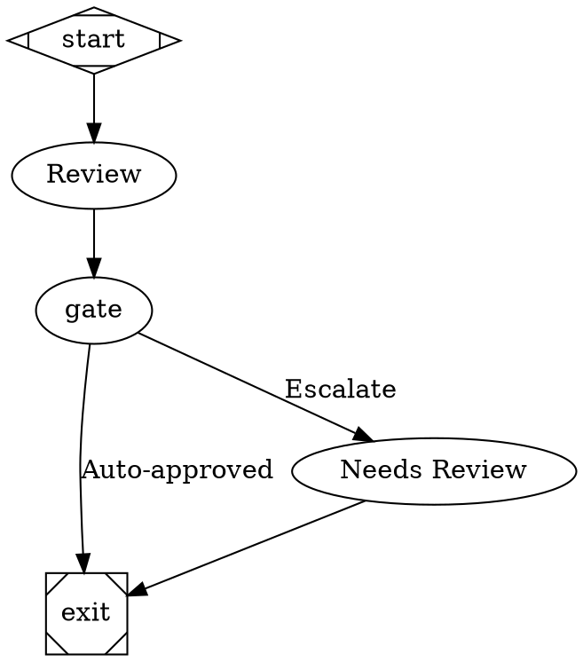
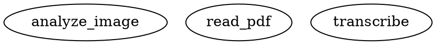

<p align="center">
  
  
</p>

<h1 align="center">Factorial</h1>

<p align="center">
  <strong>Define AI workflows as code. Execute with deterministic reliability.</strong>
</p>

<p align="center">
  <a href="https://www.npmjs.com/package/@mhingston5/factorial"></a>
  <a href="https://github.com/mhingston/factorial/blob/main/LICENSE"></a>
  
</p>

<p align="center">
  Factorial is a DOT-based workflow orchestrator for multi-stage AI pipelines. Write your workflow as a Graphviz graph, run it with built-in quality gates, human approvals, and parallel execution.
</p>

> **Reference Implementation**: Based on the [StrongDM AI Attractor](https://factory.strongdm.ai/products/attractor) with enhancements for self-hosting maturity, DTU validation, and deterministic governance.

---

## Quick Start

```bash
npm install @mhingston5/factorial
```

Requirements: Node.js >= 20

For API backend (default), also install your provider:
```bash
npm install @ai-sdk/openai  # or @ai-sdk/anthropic, @ai-sdk/google
```

### 1. Create a Workflow



### 2. Configure Environment

```bash
# .env
OPENAI_API_KEY=sk-...
```

### 3. Run It

```bash
npx factorial run --graph workflow.dot --logs-root ./logs
```

Replay later with identical config:
```bash
npx factorial replay --manifest ./logs/run_manifest.json
```

### 4. Programmatic Usage

```typescript
import { Attractor } from '@mhingston5/factorial';

const attractor = new Attractor({
  dotFile: './workflow.dot',
  logsRoot: './logs',
});

const result = await attractor.run();
console.log(`Status: ${result.status}`);
```

---

## Table of Contents

- [Why Factorial?](#why-factorial)
- [Features](#features)
- [Examples](#examples)
- [CLI Commands](#cli-commands)
- [Configuration](#configuration)
- [Workflow Builder Skill](#workflow-builder-skill)
- [Node Types](#node-types)
- [Development](#development)
- [Documentation](#documentation)

---

## Why Factorial?

| Feature | Benefit |
|---------|---------|
| **🎯 Deterministic Runs** | Same inputs produce identical outputs and artifacts |
| **🔒 Governance-Ready** | Quality gates, human escalation, and audit trails built-in |
| **⚡ Production-Grade** | Retry, checkpoints, resume, and replay out of the box |
| **🚀 Parallelizable** | Fan-out/fan-in with git worktree isolation |
| **🔌 Multi-Provider** | Optimized tooling for OpenAI, Anthropic, and Gemini |

---

## Features

### Visual Workflow Definition

Define complex AI pipelines as simple DOT graphs:



### Multi-Modal Support

Process images, PDFs, and audio files:



**Supported formats:**
- **Images**: PNG, JPEG, GIF, WEBP (all providers)
- **Documents**: PDF, TXT, MD (Anthropic + Gemini)
- **Audio**: WAV, MP3, M4A (Gemini only)

### Provider-Native Tool Profiles

Optimized tool formats for each provider:
- **OpenAI**: `apply_patch` v4a format for edits
- **Anthropic**: `edit_file` exact-match editing
- **Gemini**: `edit_file` exact-match editing

### Anthropic Prompt Caching

Reduce API costs by 50-90%:

```dot
node [llm_provider="anthropic", enable_caching="true", cache_strategy="system-plus-early"]
```

### Lightweight Subagent Tools

Spawn parallel subagents for independent tasks:

```dot
spawn [type="tool", tool_name="spawn_agent", task="Research topic"]
wait [type="tool", tool_name="wait"]
```

<details>
<summary><b>More Features</b></summary>

**Quality Gates**
- `quality.gate` - Run lint, tests, typecheck, security scans
- `judge.rubric` - AI-powered evaluation with scoring
- `confidence.gate` - Auto-approve high confidence, escalate low confidence

**Digital Twin Universe (DTU)**
Test against deterministic fixtures with reference twins for external dependencies.

**Governance & Audit**
Built-in automation for repository health, documentation freshness, and release hardening.

**Queue Interviewer (Deterministic Testing)**
Test workflows with `wait.human` nodes by pre-recording answers for CI/CD.

</details>

---

## Examples

See 20+ complete examples in [`examples/`](./examples/):

| Category | Examples |
|----------|----------|
| **Starter** | `simple.dot`, `branching.dot`, `human-gate.dot`, `parallel.dot` |
| **Quality** | `confidence-escalation.dot`, `quality-pipeline.dot`, `retry-loop.dot`, `code-review-complete.dot` |
| **Multi-modal** | `image-analysis.dot`, `document-qa.dot`, `audio-transcription.dot` |
| **Subagents** | `lightweight-subagent.dot`, `parallel-research.dot`, `manager-loop.dot` |
| **Automation** | `pr-automation.dot`, `engineering-loop-parent.dot`, `engineering-loop-child.dot` |

---

## CLI Commands

```bash
# Run and inspect
npx factorial run --graph workflow.dot
npx factorial validate --graph workflow.dot
npx factorial visualize --graph workflow.dot
npx factorial replay --manifest ./logs/run_manifest.json

# Quality and governance
npx factorial confidence-tune --logs-root ./logs
npx factorial check:freshness --artifact ./docs
npx factorial compound-weekly

# DTU and scenarios
npx factorial dtu-run --fixtures ./fixtures
npx factorial dtu-curate
npx factorial metrics:satisfaction

# Reliability and autonomy
npx factorial telemetry:aggregate
npx factorial workflow:self-modify
npx factorial cross-repo:validate
```

See [CLI Reference](docs/cli-reference.md) for complete documentation.

---

## Configuration

Create `config.json` for defaults:

```json
{
  "logs_root": "./logs",
  "llm_backend": "api",
  "default_provider": "openai",
  "providers": {
    "openai": {
      "api_key_env": "OPENAI_API_KEY",
      "default_model": "gpt-4o-mini"
    }
  },
  "checkpoint_interval": 1
}
```

**Backends:**
- `api` (default) - Vercel AI SDK with provider libraries
- `cli` - Execute external commands directly

---

## Workflow Builder Skill

Factorial includes a comprehensive AI skill for building DOT workflows:

```bash
# Available at:
skills/factorial-workflow-builder/

# Provides:
# - Complete node type reference
# - All node and graph attributes with examples
# - Common workflow patterns and best practices
```

See [skills/factorial-workflow-builder/](skills/factorial-workflow-builder/) for full documentation.

---

## Node Types

| Shape | Type | Purpose |
|-------|------|---------|
| `Mdiamond` | `start` | Entry point |
| `box` | `codergen` (default) | LLM task |
| `hexagon` | `wait.human` | Human approval |
| `diamond` | `conditional` / `confidence.gate` | Branch routing |
| `component` | `parallel` | Fan-out |
| `tripleoctagon` | `parallel.fan_in` | Fan-in |
| `Msquare` | `exit` | Exit point |

**Quality & Governance:**
- `quality.gate` - Run commands (lint, test, typecheck)
- `judge.rubric` - AI evaluation with scoring
- `failure.analyze` - Classify failures for targeted retry

See [Node Types Reference](skills/factorial-workflow-builder/references/node-types.md) for full details.

---

## Development

```bash
# Install
npm install

# Build
npm run build

# Test
npm run test:run        # Unit tests
npm run test:golden     # Regression suite
npm run test:worktree   # Git worktree parity

# Quality
npm run lint
npm run typecheck

# Audit
npm run agent:audit
npm run docs:freshness
npm run claims:audit
```

---

## Documentation

- [Roadmap](ROADMAP.md) - Current status and direction
- [Self-hosting Maturity](docs/self-hosting-maturity-ladder.md) - Level definitions and gates
- [Spec Conformance](docs/spec-conformance-matrix.md) - Attractor spec alignment
- [Companion Spec Scope](docs/companion-spec-scope-contract.md) - Implemented features
- [Execution Event Stream](docs/execution-event-stream.md) - Event schema for UI/telemetry consumers
- [DTU Satisfaction Report](docs/dtu-satisfaction-report.md) - Scenario satisfaction metrics
- [Active Handoff](docs/roadmap/active-handoff.md) - Current execution context

### Evidence Reports

- [Reasoning Token Coverage](docs/metrics/reports/reasoning-token-coverage-latest.json)
- [Anthropic Caching Effectiveness](docs/metrics/reports/anthropic-caching-effectiveness-latest.json)
- [Subagent Performance](docs/metrics/reports/subagent-performance-latest.json)
- [Reliability SLO](docs/metrics/reports/compound-reliability-slo-latest.json)
- [Full Autonomy Readiness](docs/metrics/reports/full-autonomy-readiness-latest.json)

---

## Architecture

```
DOT File → Parser → Graph AST → Execution Engine → Handlers → AI Backend
                                                      ↓
                                              (api: Vercel SDK | cli: Commands)
```

Core preserves the [Attractor execution model](https://factory.strongdm.ai/products/attractor) with production enhancements:
- Self-hosting maturity ladder with objective gates
- DTU validation platform
- Deterministic replay and flake detection
- Multi-provider parity evidence

---

## License

MIT

---

**Companion specs adopted**: `coding-agent-loop`, `unified-llm` (bounded scope)

**Current maturity level**: `full-autonomy` with FA-001–FA-009 evidence published

See [maturity ladder](docs/self-hosting-maturity-ladder.md) for ongoing maintenance criteria
