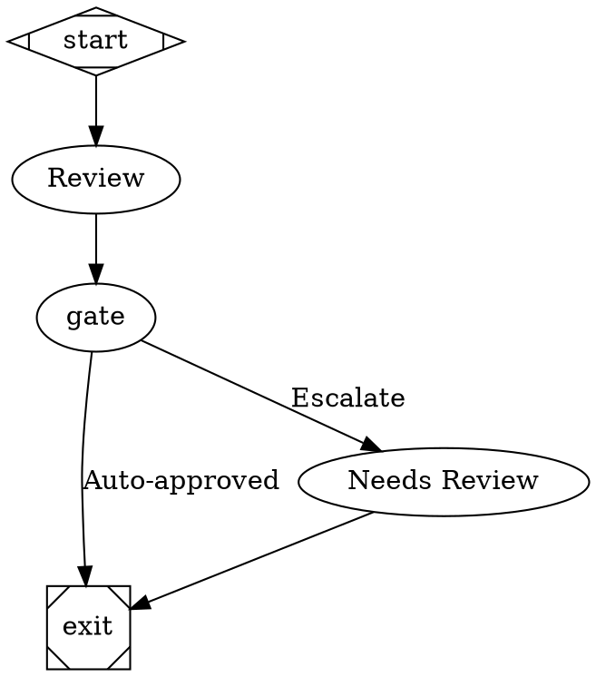
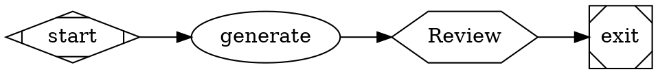
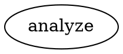
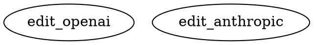
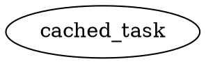
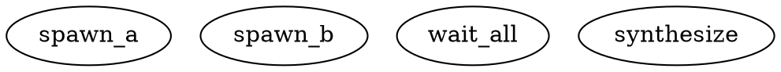

<p align="center">
  
</p>

# Factorial

**Define AI workflows as code. Execute with deterministic reliability.**

Factorial is a DOT-based workflow orchestrator for multi-stage AI pipelines. Write your workflow as a Graphviz graph, run it with built-in quality gates, human approvals, and parallel execution.

> **Reference Implementation**: Factorial is based on the [StrongDM AI Attractor](https://factory.strongdm.ai/products/attractor) (a non-interactive coding agent), with additional enhancements for self-hosting maturity, DTU validation, and deterministic governance.

- **Deterministic Runs**: Same inputs produce the same outputs and artifacts
- **Governance-Ready**: Quality gates, human escalation, and audit trails
- **Production-Grade**: Retry, checkpoints, resume, and replay out of the box
- **Parallelizable**: Fan-out/fan-in with git worktree isolation
- **Multi-Provider**: Optimized tooling for OpenAI, Anthropic, and Gemini



## Quick Start

```bash
npm install @mhingston5/factorial
```

Requirements: Node.js >= 20

For API backend (default), also install your provider:
```bash
npm install @ai-sdk/openai  # or @ai-sdk/anthropic, @ai-sdk/google
```

### 1. Create a Workflow



### 2. Configure Environment

```bash
# .env
OPENAI_API_KEY=sk-...
```

### 3. Run It

```bash
npx factorial run --graph workflow.dot --logs-root ./logs
```

Replay later with identical config:
```bash
npx factorial replay --manifest ./logs/run_manifest.json
```

### 4. Programmatic Usage

```typescript
import { Attractor } from '@mhingston5/factorial';

const attractor = new Attractor({
  dotFile: './workflow.dot',
  logsRoot: './logs',
});

const result = await attractor.run();
console.log(`Status: ${result.status}`);
```

## Core Concepts

- **Workflows as Graphs**: Version-control AI pipelines as DOT files
- **Quality Gates**: Lint, test, typecheck, and rubric-based evaluation
- **Human-in-the-Loop**: Confidence-based escalation with `wait.human`
- **Artifacts**: Structured logs, manifests, and replay metadata per node

## Examples Gallery

Starter workflows:
- `examples/simple.dot` - Linear workflow
- `examples/branching.dot` - Conditional logic with loops
- `examples/human-gate.dot` - Human approval pattern
- `examples/parallel.dot` - Parallel execution

Quality and governance:
- `examples/confidence-escalation.dot` - Confidence gate with escalation
- `examples/quality-pipeline.dot` - CI/CD quality gates
- `examples/retry-loop.dot` - Targeted retry with failure analysis
- `examples/code-review-complete.dot` - Production-ready review pipeline

Multi-modal:
- `examples/image-analysis.dot` - Image analysis (vision)
- `examples/document-qa.dot` - PDF/document Q&A
- `examples/audio-transcription.dot` - Audio transcription (Gemini)

Subagents and delegation:
- `examples/lightweight-subagent.dot` - Lightweight subagent pattern
- `examples/parallel-research.dot` - Parallel subagent research
- `examples/manager-loop.dot` - Manager loop supervisor pattern

Automation and engineering loop:
- `examples/pr-automation.dot` - PR review + merge pipeline
- `examples/engineering-loop-parent.dot` - Plan/Work/Review/Compound parent loop
- `examples/engineering-loop-child.dot` - Child loop with bounded tasks

See all examples in `examples/`.

## CLI Commands

Run and inspect:

| Command | Purpose |
|---------|---------|
| `run` | Execute a workflow |
| `validate` | Parse + lint without executing |
| `visualize` | Output graph as JSON |
| `manifest` | Inspect run metadata |
| `resume` | Continue from checkpoint |
| `replay` | Re-run from manifest with fixed config |

Quality and governance:

| Command | Purpose |
|---------|---------|
| `confidence-tune` | Tune escalation thresholds from history |
| `check:freshness` | Validate artifact freshness |
| `compound-weekly` | Generate weekly compound metrics |

DTU and scenarios:

| Command | Purpose |
|---------|---------|
| `dtu-run` | Run Digital Twin Universe scenarios |
| `dtu-curate` | Create and manage DTU scenario fixtures |
| `dtu:list-twins` | List DTU twins and operations |
| `metrics:satisfaction` | Score DTU scenario satisfaction |
| `scenarios:curate` | Scenario catalog TUI + promotion |
| `scenarios:check-freshness` | Holdout scenario freshness gate |

Reliability and autonomy:

| Command | Purpose |
|---------|---------|
| `telemetry:aggregate` | Aggregate full-autonomy telemetry |
| `workflow:self-modify` | Validate self-mod proposals + PRs |
| `cross-repo:validate` | Cross-repo coordination validation |
| `distributed:consensus-test` | Distributed consensus testing |
| `circuit-breaker:tune` | Circuit breaker tuning report |
| `metrics:economics` | Summarize token economics from logs |

Event consumers can subscribe to the execution stream documented in
[Execution Event Stream](docs/execution-event-stream.md).

## Configuration

Create `config.json` for defaults:

```json
{
  "logs_root": "./logs",
  "llm_backend": "api",
  "default_provider": "openai",
  "providers": {
    "openai": {
      "api_key_env": "OPENAI_API_KEY",
      "default_model": "gpt-4o-mini"
    }
  },
  "checkpoint_interval": 1
}
```

**Backends:**
- `api` (default) - Vercel AI SDK with provider libraries
- `cli` - Execute external commands directly

## Workflow Builder Skill

Factorial includes a comprehensive AI skill for building DOT workflows:

```bash
# The skill is available at:
# skills/factorial-workflow-builder/
#
# It provides:
# - Complete node type reference (start, codergen, wait.human, quality.gate, etc.)
# - All node and graph attributes with examples
# - Common workflow patterns and best practices
```

See [skills/factorial-workflow-builder/](skills/factorial-workflow-builder/) for the full skill documentation, including node types reference and attributes catalog.

### Queue Interviewer (Deterministic Testing)

Test workflows with `wait.human` nodes deterministically by pre-recording answers:

```typescript
import { QueueInterviewer, WaitForHumanHandler } from '@mhingston5/factorial';

// Pre-record answers for human gates
const interviewer = new QueueInterviewer([
  { key: 'A' },  // First human gate: choose option 'A'
  { key: 'R' },  // Second human gate: choose option 'R'
]);

// Use in workflow
const handler = new WaitForHumanHandler(interviewer);
```

Useful for:
- **Regression testing** - Replay known answers to verify workflow behavior
- **Deterministic CI** - Ensure consistent execution in automated tests
- **Batch processing** - Pre-configure approval chains

## Feature Highlights

### Multi-Modal Support (Images, Documents, Audio)

Process images, PDFs, and audio files in your workflows:



**Supported formats:**
- **Images**: PNG, JPEG, GIF, WEBP (all providers)
- **Documents**: PDF, TXT, MD (Anthropic + Gemini)
- **Audio**: WAV, MP3, M4A (Gemini only)

### Provider-Native Tool Profiles

Factorial uses provider-optimized tool formats for better performance:

- **OpenAI**: Uses `apply_patch` v4a format for file modifications
- **Anthropic**: Uses `edit_file` with exact-match `old_string`/`new_string` editing
- **Gemini**: Uses `edit_file` with exact-match `old_string`/`new_string` editing



### Anthropic Prompt Caching

Reduce API costs by 50-90% with automatic prompt caching:



**Cache strategies:**
- `system-only`: Cache system prompt only
- `system-plus-early`: Cache system + first 2 messages (default)
- `aggressive`: Cache all messages except latest

### Reasoning Token Tracking

Reasoning token counts are captured when providers report them. Inspect the raw usage payloads in the API response artifacts:

```bash
ls logs/<node_id>/api_response.json
```

Reasoning tokens appear in provider-specific fields (for example, OpenAI's `completion_tokens_details.reasoning_tokens`).

### Lightweight Subagent Tools

Spawn parallel subagents for independent tasks:



**Available tools:**
- `spawn_agent`: Create lightweight subagent
- `wait`: Wait for completion with summarization
- `send_input`: Send steering to running agent
- `close_agent`: Forcefully terminate agent

## Node Types

Use Graphviz shapes + Factorial types to define nodes:

| Shape | Type | Purpose |
|-------|------|---------|
| `Mdiamond` | `start` | Entry point |
| `box` | `codergen` (default) | LLM task |
| `hexagon` | `wait.human` | Human approval |
| `diamond` | `conditional` / `confidence.gate` | Branch routing |
| `component` | `parallel` | Fan-out |
| `tripleoctagon` | `parallel.fan_in` | Fan-in |
| `Msquare` | `exit` | Exit point |

**Quality & Governance:**
- `quality.gate` - Run commands (lint, test, typecheck)
- `judge.rubric` - AI evaluation with scoring
- `failure.analyze` - Classify failures for targeted retry

See [Node Types Reference](skills/factorial-workflow-builder/references/node-types.md) for full details.

## Example: Code Review Workflow

```dot
  graph [goal="Review code with quality checks"]
  
  start [shape=Mdiamond]
  exit  [shape=Msquare]
  
  lint [type="quality.gate", gate_type="lint", 
        gate_command="npm run lint"]
  test [type="quality.gate", gate_type="tests",
        gate_command="npm run test:run"]
  
  review [type="judge.rubric",
          judge_rubric_path="./review-rubric.md",
          score_threshold=0.8]
  
  gate [type="confidence.gate",
        confidence_signal_path="judge.review.score",
        escalation_threshold=0.7,
        escalation_target="human_review"]
  
  human_review [type="wait.human"]
  
  start -> lint -> test -> review -> gate
  gate -> exit [label="Auto-approved"]
  gate -> human_review [label="Needs review"]
  human_review -> exit
}
```

More examples in [`examples/`](./examples/):
See the Examples Gallery above for categorized workflows.

## Key Features (Details)

<details>
<summary><b>Deterministic Execution</b></summary>

Every run produces:
- Structured logs under `<logs_root>/<node_id>/`
- `run_manifest.json` with full provenance
- Checkpoint files for resume/replay
- Reproducible with `factorial replay`
</details>

<details>
<summary><b>Quality Gates</b></summary>

Enforce standards before proceeding:
- `quality.gate` - Run lint, tests, typecheck, security scans
- `judge.rubric` - AI-powered evaluation with scoring
- `confidence.gate` - Auto-approve high confidence, escalate low confidence
- Promotion stages: `dev` → `canary` → `prod` with increasing strictness
</details>

<details>
<summary><b>Multi-Modal Support</b></summary>

Process images, documents, and audio in workflows:

```dot
  analyze_image [prompt="Describe this UI", image_input="./ui.png"]
  read_pdf [prompt="Summarize findings", document_input="./paper.pdf"]
  transcribe [prompt="Transcribe meeting", audio_input="./meeting.m4a", llm_provider="gemini"]
}
```

- **Images**: PNG, JPEG, GIF, WEBP (all providers)
- **Documents**: PDF, TXT, MD (Anthropic + Gemini)
- **Audio**: WAV, MP3, M4A (Gemini only)
</details>

<details>
<summary><b>Provider-Native Tool Profiles</b></summary>

Optimized tool formats for each provider:

- **OpenAI**: `apply_patch` v4a format for edits
- **Anthropic**: `edit_file` exact-match editing (`old_string`/`new_string`)
- **Gemini**: `edit_file` exact-match editing (`old_string`/`new_string`)

Set per-node: `llm_provider="openai"` | `"anthropic"` | `"gemini"`
</details>

<details>
<summary><b>Anthropic Prompt Caching</b></summary>

Reduce costs by 50-90% with automatic caching:

```dot
node [llm_provider="anthropic", enable_caching="true", cache_strategy="system-plus-early"]
```

Strategies: `system-only`, `system-plus-early`, `aggressive`
</details>

<details>
<summary><b>Reasoning Token Tracking</b></summary>

Reasoning token counts are captured when providers report them. Inspect the raw usage payloads in the API response artifacts:

```bash
ls logs/<node_id>/api_response.json
```

Reasoning tokens appear in provider-specific fields (for example, OpenAI's `completion_tokens_details.reasoning_tokens`).
</details>

<details>
<summary><b>Lightweight Subagent Tools</b></summary>

Spawn parallel subagents for independent tasks:

```dot
  spawn [type="tool", tool_name="spawn_agent", task="Research topic"]
  wait [type="tool", tool_name="wait"]
}
```

Tools: `spawn_agent`, `wait`, `send_input`, `close_agent`
</details>

<details>
<summary><b>Parallel Worktree Isolation</b></summary>

For parallel branches that modify files:

```dot
  parallel [type="parallel", worktree_isolation="true"]
  variant_a [cli_command="generate python"]
  variant_b [cli_command="generate typescript"]
  merge [type="parallel.fan_in", merge_strategy="consensus"]
}
```

Each branch runs in isolated git worktree, merged at fan-in.
</details>

<details>
<summary><b>Digital Twin Universe (DTU)</b></summary>

Test against deterministic fixtures:
- Reference twins for external dependencies (Jira, Slack, GitHub, AWS S3, Database)
- Scenario harness for smoke/regression/holdout testing
- Deterministic failure simulation

```bash
npm run dtu:run
```
</details>

<details>
<summary><b>Scenario Satisfaction Reports</b></summary>

DTU runs emit a satisfaction report (pass-rate and holdout-rate) you can track as a factory KPI.

```bash
npm run dtu:run
```

The report schema and fields are documented in [DTU Satisfaction Report](docs/dtu-satisfaction-report.md).
</details>

<details>
<summary><b>Governance & Audit</b></summary>

Built-in automation for repository health:
- Documentation freshness checks
- Cross-document claims consistency
- PR compound artifact validation
- Release hardening (SBOM, signing)
- Reliability SLO monitoring

See [Governance Scripts](#governance-scripts) below.
</details>

## Development

```bash
# Install
npm install

# Build
npm run build

# Test
npm run test:run        # Unit tests
npm run test:golden     # Regression suite
npm run test:worktree   # Git worktree parity

# Quality
npm run lint
npm run typecheck

# Audit
npm run agent:audit
npm run docs:freshness
npm run claims:audit
```

## Governance Scripts

Reuse Factorial's governance automation in your repo:

```bash
# Documentation freshness (README/AGENTS/ROADMAP sync)
node node_modules/@mhingston5/factorial/scripts/docs-freshness-audit.js \
  --readme ./README.md --agents ./AGENTS.md --roadmap ./ROADMAP.md \
  --package-json ./package.json --report ./logs/freshness.json

# Claims consistency (roadmap/spec/matrix alignment)
node node_modules/@mhingston5/factorial/scripts/claims-consistency-audit.js \
  --roadmap ./ROADMAP.md --matrix ./docs/spec-conformance-matrix.md \
  --report ./logs/consistency.json

# PR compound validation
node node_modules/@mhingston5/factorial/scripts/check-pr-compound-artifacts.js \
  --body-file ./pr-body.md
```

## Architecture

```
DOT File → Parser → Graph AST → Execution Engine → Handlers → AI Backend
                                                      ↓
                                              (api: Vercel SDK | cli: Commands)
```

Core preserves the [Attractor execution model](https://factory.strongdm.ai/products/attractor) with production enhancements:
- Self-hosting maturity ladder with objective gates
- DTU validation platform
- Deterministic replay and flake detection
- Multi-provider parity evidence

## Documentation

- [Roadmap](ROADMAP.md) - Current status and direction
- [Self-hosting Maturity](docs/self-hosting-maturity-ladder.md) - Level definitions and gates
- [Spec Conformance](docs/spec-conformance-matrix.md) - Attractor spec alignment
- [Companion Spec Scope](docs/companion-spec-scope-contract.md) - Implemented features
- [Execution Event Stream](docs/execution-event-stream.md) - Event schema for UI/telemetry consumers
- [DTU Satisfaction Report](docs/dtu-satisfaction-report.md) - Scenario satisfaction metrics
- [Active Handoff](docs/roadmap/active-handoff.md) - Current execution context

### Evidence Reports

- [Reasoning Token Coverage](docs/metrics/reports/reasoning-token-coverage-latest.json) - Reasoning tracking by provider
- [Anthropic Caching Effectiveness](docs/metrics/reports/anthropic-caching-effectiveness-latest.json) - 79% cost reduction
- [Subagent Performance](docs/metrics/reports/subagent-performance-latest.json) - Lightweight vs ManagerLoop comparison
- [Self-host Provider-Backed](docs/metrics/reports/self-host-provider-backed-latest.json) - Provider-backed maturity evidence
- [Self-host Provider-Backed Live](docs/metrics/reports/self-host-provider-backed-live-latest.json) - Bounded live-canary evidence
- [Self-host Autonomous](docs/metrics/reports/self-host-autonomous-latest.json) - Autonomous guardrail evidence
- [Reliability SLO](docs/metrics/reports/compound-reliability-slo-latest.json) - Reliability lock decision gate
- [Full Autonomy Readiness](docs/metrics/reports/full-autonomy-readiness-latest.json) - FA gate rollup

## License

MIT

---

**Companion specs adopted**: `coding-agent-loop`, `unified-llm` (bounded scope)

**Current maturity level**: `full-autonomy` with FA-001–FA-009 evidence published

See [maturity ladder](docs/self-hosting-maturity-ladder.md) for ongoing maintenance criteria
