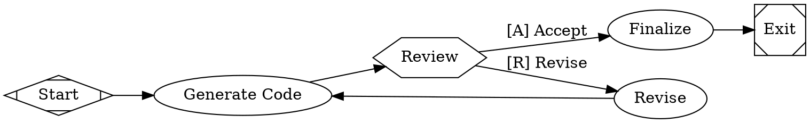

# Factorial

A TypeScript implementation of the **Attractor pattern** - a DOT-based pipeline runner for orchestrating multi-stage AI workflows.

## Overview

Factorial lets you define complex AI workflows as directed graphs using Graphviz DOT syntax. Each node represents a task (LLM call, human review, conditional logic, parallel execution), and edges define the flow between them.

## Features

- Declarative DOT workflows (version-friendly and self-documenting)
- Deterministic execution with retry, checkpointing, resume, and replay
- Built-in human approval, parallel fan-out/fan-in, and conditional routing
- Dual LLM backends: Vercel AI SDK (`api`) or provider CLI execution (`cli`)
- Strict linting and validation for production-oriented graph quality controls
- Full TypeScript API and CLI with structured execution artifacts
- DTU validation platform: reference twins, scenario harness, holdout satisfaction reporting, and deterministic failure simulation fixtures

## Installation

```bash
npm install @mhingston5/factorial
```

This package requires Node.js `>=20`.

If you're using the `api` backend, install your preferred LLM provider:

```bash
npm install ai-sdk-provider-github  # plus @ai-sdk/openai / @ai-sdk/anthropic / @ai-sdk/google as needed
```

For CLI usage, environment variables are loaded from `.env` and `.env.local` by default.

CLI invocation options:

- Installed in project: `npx factorial ...`
- One-off without install: `npx @mhingston5/factorial ...`

## Quick Start

### 1. Define a Workflow

Create a `workflow.dot` file:



### 2. Run the Pipeline

```bash
npx factorial run --graph workflow.dot --logs-root ./logs
```

Replay with the same fixed config from a prior run manifest:

```bash
npx factorial replay --manifest ./logs/run_manifest.json --logs-root ./logs/replay
```

Run with the CLI backend instead of the Vercel AI SDK:

```bash
npx factorial run --graph workflow.dot --logs-root ./logs --llm-backend cli
```

Use a specific env file (repeat `--env-file` to load multiple):

```bash
npx factorial run --graph workflow.dot --logs-root ./logs --env-file .env.dev
```

### 3. Programmatic Usage

```typescript
import { Attractor } from '@mhingston5/factorial';

const attractor = new Attractor({
  dotFile: './workflow.dot',
  logsRoot: './logs',
});

// Run the pipeline
const result = await attractor.run();
console.log(`Status: ${result.status}`);
```

To subscribe to execution events, instantiate `ExecutionEngine` directly and attach `engine.on('event', ...)` before calling `run()`.

## CLI Commands

| Command | Purpose |
|---|---|
| `run` | Execute a workflow from DOT |
| `resume` | Continue from latest or specified checkpoint |
| `replay` | Re-run from a prior run manifest with fixed config |
| `manifest` | Summarize replay/provenance metadata and optionally diff manifests |
| `dtu-run` | Execute DTU scenario fixtures and emit a satisfaction report |
| `validate` | Parse + lint workflow without execution |
| `visualize` | Output parsed graph JSON |

Examples:

```bash
# Validate only
npx factorial validate --graph workflow.dot --strict

# Inspect parsed graph structure
npx factorial visualize --graph workflow.dot

# Resume from a specific checkpoint
npx factorial resume --graph workflow.dot --checkpoint ./logs/checkpoint.json

# Summarize and compare replay/provenance fields across manifests
npx factorial manifest --manifest ./logs/replay/run_manifest.json --compare ./logs/run_manifest.json --json

# Run DTU scenarios and write report
npx factorial dtu-run --fixtures ./tests/fixtures/dtu/scenarios --report ./reports/dtu_satisfaction_report.json
```

## Node Types

| Shape | Type | Description |
|-------|------|-------------|
| `Mdiamond` | `start` | Pipeline entry point |
| `Msquare` | `exit` | Pipeline exit point |
| `box` | `codergen` | LLM task (default) |
| `hexagon` | `wait.human` | Human approval gate |
| `diamond` | `conditional` | Conditional routing |
| `diamond` | `confidence.gate` | Confidence-based autonomous/escalation routing |
| `component` | `parallel` | Parallel fan-out |
| `tripleoctagon` | `parallel.fan_in` | Parallel fan-in |
| `box` | `quality.gate` | Run command-based quality checks |
| `box` | `judge.rubric` | Rubric-scored evaluation with structured output |
| `box` | `failure.analyze` | Failure classification for targeted retries |
| `box` | `stack.observe` / `stack.steer` | Observer/steering codergen stages |
| `parallelogram` | `tool` | External tool execution |
| `house` | `stack.manager_loop` | Supervisor pattern |

Reference compatibility notes:

- `shape=circle` is treated as `start`
- `shape=doublecircle` is treated as `exit`
- `node_type` is accepted as an alias for `type`
- `stack.observe` and `stack.steer` are handled by the codergen handler in CLI runs

## Configuration

Create a `config.json`:

```json
{
  "logs_root": "./logs",
  "llm_backend": "api",
  "default_provider": "openai",
  "llm_provider": "openai",
  "llm_model": "gpt-4",
  "providers": {
    "openai": {
      "api_key_env": "OPENAI_API_KEY",
      "default_model": "gpt-4o-mini"
    },
    "anthropic": {
      "api_key_env": "ANTHROPIC_API_KEY",
      "default_model": "claude-3-5-sonnet-latest"
    }
  },
  "checkpoint_interval": 1
}
```

- `llm_backend`: `api` (default) or `cli`
- `default_provider`: Fallback provider when node/provider config omits `llm_provider`
- `llm_provider`: `openai`, `anthropic`, `google`, or `github`
- `llm_model`: provider-specific model name
- `providers.<name>.api_key_env`: Environment variable name containing the provider API key
- `providers.<name>.default_model`: Provider-specific default model fallback

When `llm_backend` is `cli`, codergen nodes run external commands instead of `generateText` / `generateObject`.

## Node Attributes

- `prompt`: Instruction for codergen nodes
- `llm_backend`: Per-node backend override (`api` or `cli`)
- `llm_provider`: Per-node provider override
- `llm_model`: Per-node model override
- `output_contract_required`: Require schema-backed structured output (`true` or `false`, default `false`)
- `output_schema`: Inline JSON schema for structured output
- `output_schema_path`: Path to a JSON schema file for structured output
- `output_mode`: Structured output mode (`auto`, `json`, `tool`)
- `merge_strategy`: Fan-in merge strategy (`best_score`, `consensus`, `arbiter`)
- `merge_tiebreak`: Fan-in tie-break (`weight`, `lexical`, `latest`)
- `arbiter_prompt`: Required when `merge_strategy=arbiter`
- `gate_type`: Quality gate type (`tests`, `lint`, `typecheck`, `security`, `custom`)
- `pass_condition`: Condition expression for gate pass routing
- `failure_target`: Node ID for deterministic fail routing
- `confidence_signal_path`: Context key containing numeric confidence value
- `escalation_threshold`: Confidence threshold in range `[0,1]` for escalation
- `escalation_target`: Optional explicit wait.human target node ID for escalation
- `gate_command`: Optional explicit command for `quality.gate` nodes
- `judge_rubric_path`: Path to rubric file for `judge.rubric` nodes
- `score_threshold`: Numeric minimum score required by `judge.rubric`
- `score_weights`: Optional JSON object of weighted rubric dimensions
- `retry_policy`: Retry mode (`none`, `standard`, `targeted`)
- `retry_classifier_schema`: Optional JSON schema for `failure.analyze` output
- `retry_target_map`: JSON map of retry targets by class
- `retry_target_transient`: Retry target for transient failures
- `retry_target_quality_gap`: Retry target for quality gap failures
- `retry_target_tool_error`: Retry target for tool errors
- `retry_target_spec_mismatch`: Retry target for spec mismatch failures
- `budget_max_tokens`: Per-node token ceiling (positive number)
- `budget_max_cost_usd`: Per-node cost ceiling in USD (positive number)
- `cli_command`: Raw shell command to execute in CLI backend mode
- `cli_executable`: Executable name/path when not using `cli_command`
- `cli_args`: JSON array of args when not using `cli_command`
- `cli_env`: JSON object of environment variable overrides
- `cli_cwd`: Working directory for CLI execution
- `cli_timeout_ms`: Timeout in milliseconds for CLI execution
- `max_retries`: Number of retry attempts
- `goal_gate`: Must succeed before pipeline can exit
- `timeout`: Per-node duration ceiling in milliseconds (positive number)
- `stack_child_dotfile`: Child workflow reference for `stack.manager_loop`
- `manager_actions`: Manager action list (`delegate`, `observe`, `steer`, `wait`)
- `manager_poll_interval`: Manager poll interval in milliseconds (>= 0)
- `manager_max_cycles`: Max manager polling cycles (>= 1)
- `manager_stop_condition`: Optional condition expression evaluated each cycle
- `manager_require_lock`: Require child lock decision (`resolved|reopen`) on close
- `manager_local_child_execution`: When `true`, run delegated child via local adapter hook (requires `manager_actions` includes `delegate`)

## Graph Attributes

- `budget_max_tokens`: Run-level token ceiling across executed nodes
- `budget_max_cost_usd`: Run-level cost ceiling in USD
- `budget_max_duration_ms`: Run-level wall-clock duration ceiling in milliseconds
- `promotion_stage`: Workflow promotion target (`dev`, `canary`, `prod`)
- `quality_profile`: Validation strictness (`baseline`, `strict`, `regulated`)

Promotion overlays (lint-enforced):

- `canary` requires at least strict profile behavior.
- `prod` requires regulated profile behavior.
- `strict` profiles require codergen contracts and at least one `quality.gate`.
- `regulated` profiles require non-custom gate types and at least one `judge.rubric`.

## Edge Attributes

- `condition`: Edge condition expression
- `weight`: Edge priority (higher = preferred)
- `label`: Human-readable route label
- `fidelity`: Override branch fidelity (`compact` or `full`)
- `thread_id`: Explicit thread affinity for branch routing
- `loop_restart`: Emit restart boundary and continue at target in a fresh run segment (`<logs_root>/restart-XXX`)

## Codergen Artifacts

Each codergen run writes artifacts under `<logs_root>/<node_id>/`.

Always written:

- `prompt.md`
- `response.md`
- `status.json`
- `output.json`
- `validation.json`
- `events.ndjson`
- `events.json`

API backend (`llm_backend=api`) adds:

- `api_request.json`
- `api_response.json`
- `usage.json` (when provider usage/cost metadata is available)

CLI backend (`llm_backend=cli`) adds:

- `cli_invocation.json`
- `stdout.log`
- `stderr.log`

When structured output is configured (`output_schema` or `output_schema_path`), both backends also write:

- `output_schema.json`

When `output_contract_required=true`, codergen fails deterministically if no schema is provided or schema validation fails.
`output.json` always includes `validation_result` and `validation_errors`.
When usage metadata is available, `output.json` also includes `usage`.

Fan-in nodes (`parallel.fan_in`) also write:

- `fan_in_decision.json` (branch scores, strategy/tie-break, selected winner or consensus output)

Quality gate nodes (`quality.gate`) also write:

- `gate_result.json`
- `stdout.log`
- `stderr.log`

Confidence gate nodes (`confidence.gate`) also write:

- `confidence_result.json` (observed confidence, threshold, decision, escalation target)

Judge nodes (`judge.rubric`) run through codergen with strict structured output validation and set:

- `judge.<node_id>.score`
- `judge.<node_id>.score_threshold`
- `judge.<node_id>.passed`

Failure analysis nodes (`failure.analyze`) run through codergen with strict structured output validation and set:

- `failure.class`
- `retry.class`
- `failure.analyze.<node_id>.class`

## Run Manifest Artifact

Each execution (run/resume/replay) writes `<logs_root>/run_manifest.json` with:

- schema version (`run_manifest.v1`)
- source references (graph path, config path, manifest/checkpoint source)
- graph metadata (`promotion_stage`, `quality_profile`, node/edge counts)
- runtime metadata (`strange_attractor_version`, Node/platform info)
- fixed run config used for execution
- normalized outcome + checkpoint/node outcome summary
- model/provider provenance per executed model-backed node, including:
  - adapter/backend/operation/output mode
  - usage (`input_tokens`, `output_tokens`, `total_tokens`, `cost_usd`)
  - tooling artifact paths (`api_request_path`, `api_response_path`, `cli_invocation_path`, `stdout_path`, `stderr_path`)

When any budget limits are configured, the engine writes:

- `<logs_root>/budget_usage.json` (run-level cumulative usage, limits, breach/errors)
- `<logs_root>/<node_id>/budget_result.json` (per-node usage + limit evaluation)

To inspect replay/provenance ergonomics quickly:

- `npx factorial manifest --manifest <path/to/run_manifest.json>`
- `npx factorial manifest --manifest <replay_manifest> --compare <baseline_manifest> --json`

## Examples

See the [`examples/`](./examples/) directory for sample workflows:

- `simple.dot` - Linear workflow
- `branching.dot` - Conditional logic with loops
- `human-gate.dot` - Human-in-the-loop approval
- `parallel.dot` - Parallel execution

## Architecture

```
┌─────────────────┐
│   DOT Parser    │  ← Parse .dot files to Graph AST
└────────┬────────┘
         │
┌────────▼────────┐
│ Execution Engine│  ← Traverse graph, execute handlers
└────────┬────────┘
         │
┌────────▼────────┐
│ Handler Registry│  ← Dispatch to node handlers
└────────┬────────┘
         │
┌────────▼────────┐
│   AI Backend    │  ← `api`: Vercel AI SDK, `cli`: provider CLI
└─────────────────┘
```

## Digital Twin Universe (DTU) Status

Implemented in this repository:

- twin invocation contract schemas (request/response/error/timing),
- backend-agnostic runtime boundaries with in-memory execution,
- two reference twins (`jira.issue`, `slack.channel`) with deterministic parity fixtures,
- non-interactive DTU scenario harness for `smoke`, `regression`, and `holdout` suites,
- satisfaction report artifacts with totals, pass rate, holdout rate, and drift deltas,
- deterministic failure simulation coverage for rate limit, auth failure, timeout, malformed payload, and partial outage.

Run DTU scenarios locally:

```bash
npm run dtu:run
```

References:

- Roadmap: [`ROADMAP.md`](./ROADMAP.md)
- 0.3 execution plan: [`docs/roadmap/0.3-digital-twin-universe-execution-plan.md`](./docs/roadmap/0.3-digital-twin-universe-execution-plan.md)
- Phase A implementation slice: [`docs/roadmap/0.3-phase-a-dtu-foundations-vertical-slice.md`](./docs/roadmap/0.3-phase-a-dtu-foundations-vertical-slice.md)
- DTU completion report: [`docs/roadmap/0.3-dtu-validation-platform-completion.md`](./docs/roadmap/0.3-dtu-validation-platform-completion.md)

## Development

```bash
# Install dependencies
npm install

# Build the project
npm run build

# Run tests
npm test

# Run tests once (CI mode)
npm run test:run

# Run tests with coverage gate
npm run test:coverage

# Run golden regression suite
npm run test:golden

# Validate git worktree execution parity
npm run test:worktree

# Lint
npm run lint

# Audit local agent execution capabilities
npm run agent:audit

# Validate PR compound artifact requirements (local body file)
npm run check:pr-compound -- --body-file ./path/to/pr-body.md

# Generate weekly compound metrics report
npm run metrics:compound-weekly -- --start 2026-02-09 --end 2026-02-15

# Run deterministic self-host dogfooding scenarios (resolved pass + reopen fail)
npm run dogfood:self-host

# Type check
npm run typecheck
```

## Git Worktree Support

Running workflows from git worktrees is supported.

Validation command:

```bash
npm run test:worktree
```

Caveat:
- This command requires a resolvable `HEAD` commit to create a detached worktree.
- It also requires a clean tracked working tree by default (`WORKTREE_PARITY_ALLOW_DIRTY=1` overrides this for local debugging).
- In local pre-commit or scratch checkouts with no `HEAD`, or with tracked uncommitted changes, the script exits as `SKIP`.
- CI runs in strict mode (`WORKTREE_PARITY_REQUIRE_HEAD=1`) so no-`HEAD` becomes a hard failure.

What this check verifies:

- run/resume execution succeeds from both primary checkout and a detached worktree,
- logs, checkpoints, and run manifests are produced in both contexts,
- normalized manifest outputs match across primary checkout vs worktree execution.

## Compound Engineering Operating System

Feature work in this repository follows a Plan -> Work -> Review -> Compound loop.

Core references:

- PRD: [`docs/plans/rmd-020-subagent-orchestration-prd.md`](./docs/plans/rmd-020-subagent-orchestration-prd.md)
- Root operating rules: [`AGENTS.md`](./AGENTS.md)
- Plan template: [`docs/templates/plan.md`](./docs/templates/plan.md)
- Review template: [`docs/templates/review.md`](./docs/templates/review.md)
- Compound template: [`docs/templates/compound.md`](./docs/templates/compound.md)
- Solution knowledge base: [`docs/solutions/README.md`](./docs/solutions/README.md)
- Compounding metrics: [`docs/metrics/compound-rate.md`](./docs/metrics/compound-rate.md)

PRs should include:

- a plan artifact link,
- a structured review summary with bounded findings,
- batch-scoped verification results,
- a consensus lock decision (`resolved` or `reopen`),
- a compound artifact (or an explicit reason it is not needed).

## Release

- Update `CHANGELOG.md`
- Follow `RELEASE.md` for version bump and tag-based publish

## License

MIT

## Acknowledgments

This implementation is based on the [Attractor Specification](https://factory.strongdm.ai/) from StrongDM's Software Factory research.
