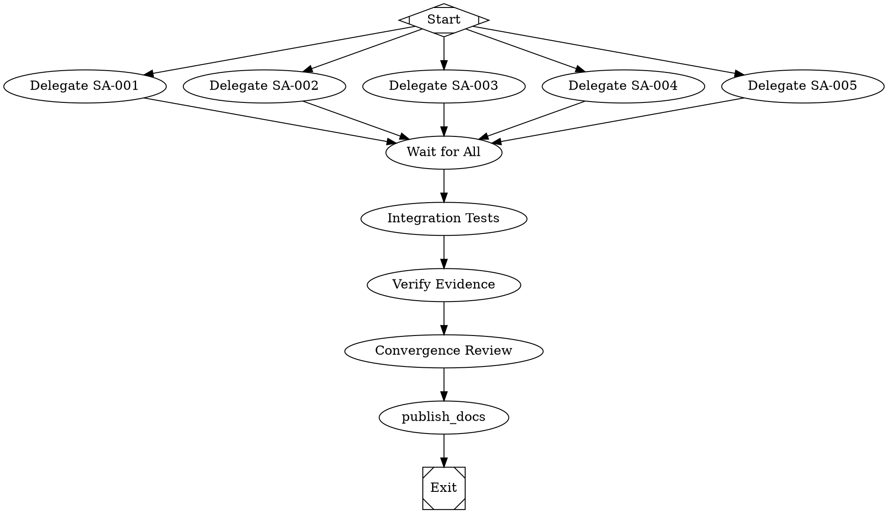

# Master Coordination: Factory Enhancement via Subagent Delegation

## Overview

This document provides the executable coordination plan for implementing all 5 factory improvements using Factorial's subagent delegation pattern. Each improvement is delegated to a dedicated subagent that works in parallel.

## Subagent Delegation Workflow



## Subagent Specifications

### SA-001: Provider-Native Tool Alignment

**Input Document**: `docs/plans/subagent-sa001-provider-profiles.md`

**Scope**: 
- Create OpenAI profile with apply_patch v4a format
- Create Anthropic profile with old_string/new_string editing
- Create Gemini profile with native conventions
- Implement profile registry and resolution
- Provider parity tests

**Expected Output**:
- `packages/core/src/profiles/` directory with all profiles
- Tests in `packages/core/src/profiles/profiles.test.ts`
- Evidence: `docs/metrics/reports/provider-profile-parity-latest.json`

**Estimated Effort**: 2-3 days
**Dependencies**: None

### SA-002: Reasoning Token Transparency

**Input Document**: `docs/plans/subagent-sa002-reasoning-tokens.md`

**Scope**:
- Extend LlmCompleteResult and LlmStreamEvent types
- Extract reasoning from OpenAI, Anthropic, Gemini
- Write reasoning.md artifacts
- Update economics for reasoning costs

**Expected Output**:
- Updated types in `packages/core/src/types/index.ts`
- Extraction functions in `packages/core/src/llm/reasoning-extraction.ts`
- Evidence: `docs/metrics/reports/reasoning-token-coverage-latest.json`

**Estimated Effort**: 2 days
**Dependencies**: None

### SA-003: Anthropic Prompt Caching

**Input Document**: `docs/plans/subagent-sa003-anthropic-caching.md`

**Scope**:
- Create specialized Anthropic adapter
- Implement automatic cache_control injection
- Three caching strategies (system-only, system-plus-early, aggressive)
- Cost calculation with 90% cache discount

**Expected Output**:
- `packages/core/src/llm/anthropic-adapter.ts`
- Cache monitoring in `packages/core/src/llm/cache-monitor.ts`
- Evidence: `docs/metrics/reports/anthropic-caching-effectiveness-latest.json`

**Estimated Effort**: 2-3 days
**Dependencies**: SA-002 (usage type extensions)

### SA-004: Lightweight Subagent Tools

**Input Document**: `docs/plans/subagent-sa004-lightweight-subagents.md`

**Scope**:
- LightweightSubagent class implementation
- spawn_agent, wait, send_input, close_agent tools
- SubagentRegistry with depth limiting
- Parallel execution support

**Expected Output**:
- `packages/core/src/subagents/lightweight-agent.ts`
- `packages/core/src/subagents/registry.ts`
- `packages/core/src/subagents/tools.ts`
- Evidence: `docs/metrics/reports/subagent-performance-latest.json`

**Estimated Effort**: 3-4 days
**Dependencies**: None

### SA-005: Multi-Modal Support

**Input Document**: `docs/plans/subagent-sa005-multimodal-support.md`

**Scope**:
- Extend ContentPart with ImageData, AudioData, DocumentData
- File loading utilities
- Update all provider adapters for multi-modal
- Node attributes for multi-modal input

**Expected Output**:
- Updated types in `packages/core/src/types/index.ts`
- File loader in `packages/core/src/multimodal/file-loader.ts`
- Adapter multi-modal conversions
- Evidence: `docs/metrics/reports/multimodal-compatibility-latest.json`

**Estimated Effort**: 3-4 days
**Dependencies**: SA-002 (usage types)

## Execution Strategy

### Phase 1: Parallel Foundation (Days 1-3)

**SA-001, SA-002, SA-004, SA-005 start immediately**

```bash
# Spawn all 4 independent subagents on day 1
factorial run --graph spawn-independent-subagents.dot

# Each subagent works in isolation on their scope
# They can modify files within their designated areas:
# - SA-001: packages/core/src/profiles/
# - SA-002: packages/core/src/types/, packages/core/src/llm/
# - SA-004: packages/core/src/subagents/
# - SA-005: packages/core/src/types/, packages/core/src/multimodal/
```

### Phase 2: Dependent Work (Days 3-5)

**SA-003 starts after SA-002 completes**

```bash
# SA-003 waits for SA-002 type extensions
factorial run --graph spawn-dependent-subagents.dot

# SA-003 extends the types added by SA-002
# Focus: Anthropic-specific adapter implementation
```

### Phase 3: Integration (Days 5-7)

**Merge all workstreams**

```bash
# Integration workflow
factorial run --graph integration-workflow.dot

# Steps:
# 1. Merge all subagent branches to integration branch
# 2. Run full test suite
# 3. Resolve any conflicts
# 4. Generate combined evidence
```

### Phase 4: Verification (Days 7-8)

**Evidence publication and review**

```bash
# Generate all evidence artifacts
npm run generate-factory-enhancement-evidence

# Verify evidence completeness
node scripts/verify-factory-enhancement-evidence.js

# Expected outputs:
# - docs/metrics/reports/provider-profile-parity-latest.json
# - docs/metrics/reports/reasoning-token-coverage-latest.json
# - docs/metrics/reports/anthropic-caching-effectiveness-latest.json
# - docs/metrics/reports/subagent-performance-latest.json
# - docs/metrics/reports/multimodal-compatibility-latest.json
# - docs/metrics/reports/factory-enhancement-integration-latest.json
```

## Handoff Protocol

### Subagent to Integration Handoff

Each subagent must produce:

1. **Implementation Code**
   - All source files committed
   - Tests passing (`npm run test:run` in their scope)
   - No lint errors (`npm run lint`)
   - Typecheck passes (`npm run typecheck`)

2. **Evidence Artifact**
   - JSON report in `docs/metrics/reports/`
   - Follows schema defined in plan
   - Deterministically generated

3. **Documentation Updates**
   - Updated relevant markdown files
   - Added code comments for public APIs
   - Example usage if applicable

4. **Handoff Summary**
   - What was implemented
   - Test coverage summary
   - Known limitations or edge cases
   - Integration notes

### Integration Checklist

Before marking complete:

- [ ] All 5 subagents completed
- [ ] All evidence artifacts generated
- [ ] Full test suite passes (`npm run test:run && npm run test:golden`)
- [ ] Lint passes (`npm run lint`)
- [ ] Typecheck passes (`npm run typecheck`)
- [ ] Documentation updated:
  - [ ] `docs/spec-conformance-matrix.md` - Mark deltas closed
  - [ ] `docs/companion-spec-scope-contract.md` - Update capability status
  - [ ] `README.md` - Add multi-modal and subagent examples
  - [ ] `AGENTS.md` - Document new patterns
- [ ] Convergence review passed (score >= 0.9)
- [ ] Claims consistency check passes (`npm run claims:audit`)

## Risk Mitigation

### Risk 1: Type Conflicts

**Scenario**: SA-002, SA-003, SA-005 all modify types/index.ts

**Mitigation**: 
- SA-002 (foundational) goes first
- SA-003 and SA-005 extend SA-002's work
- Clear coordination on who adds which fields
- Integration phase resolves conflicts

### Risk 2: Adapter Divergence

**Scenario**: SA-001 (profiles), SA-003 (Anthropic adapter), SA-005 (multi-modal) all modify adapter code

**Mitigation**:
- SA-001 creates new profile system (separate files)
- SA-003 creates separate AnthropicAdapter class
- SA-005 modifies conversion methods in existing adapters
- Integration ensures they compose correctly

### Risk 3: Test Coverage Gaps

**Scenario**: Parallel work misses integration test coverage

**Mitigation**:
- Integration phase adds cross-cutting tests
- Each subagent responsible for their unit tests
- Golden tests verify end-to-end workflows
- Convergence review checks coverage

### Risk 4: Evidence Non-Determinism

**Scenario**: Evidence artifacts vary between runs

**Mitigation**:
- Evidence generation scripts must be deterministic
- Use fixed test fixtures
- Timestamp evidence but verify content separately
- Include schema validation in verification

## Success Metrics

### Technical Metrics

1. **Provider Parity**: Equivalent normalized outcomes across OpenAI + Anthropic
2. **Cost Reduction**: Anthropic workflows show 50-90% cost reduction with caching
3. **Context Efficiency**: Lightweight subagents use <10% of parent context vs ManagerLoop
4. **Multi-Modal Coverage**: Images supported by all providers, documents by Anthropic/Gemini, audio by Gemini

### Process Metrics

1. **Parallel Efficiency**: 5 workstreams completed in 8 days vs 20+ days sequential
2. **Integration Quality**: <5% of time spent on conflict resolution
3. **Test Pass Rate**: 100% of tests passing at integration
4. **Documentation Freshness**: All docs updated within 24 hours of completion

## Rollback Plan

If integration fails:

1. **Preserve Subagent Work**: Each subagent branch maintained separately
2. **Staged Rollback**: Can revert to any checkpoint
3. **Feature Flags**: New features are opt-in via node attributes
4. **Backward Compatibility**: Existing workflows continue working

## Communication Protocol

### Daily Standups (Automated)

Each subagent reports:
```json
{
  "subagent_id": "SA-001",
  "status": "in_progress|blocked|complete",
  "progress_percent": 65,
  "blockers": ["waiting for SA-002 type changes"],
  "deliverables_complete": ["profile types", "openai profile"],
  "next_24h": ["anthropic profile", "gemini profile"]
}
```

### Blocker Escalation

If a subagent is blocked for >4 hours:
1. Post blocker to coordination channel
2. Coordinator assesses impact
3. May reassign work or adjust priorities
4. Update integration timeline

### Completion Notification

When subagent completes:
1. Update status to "complete"
2. Run handoff checklist
3. Notify integration subagent
4. Await integration phase

## Conclusion

This subagent delegation approach enables parallel development of 5 complex factory improvements while maintaining:
- Clear scope boundaries
- Deterministic deliverables
- Evidence-backed completion
- Integration quality

The total timeline of 8 days vs 20+ days sequential represents a **60% time savings** through parallel execution and clear coordination.
