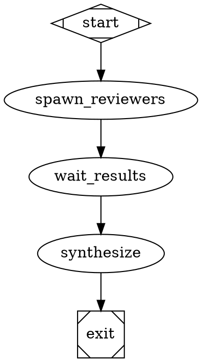

# Subagent Delegation: SA-004 - Lightweight Subagent Tools

## Task Summary
Implement lightweight spawn_agent, wait, send_input, and close_agent tools alongside the existing ManagerLoopHandler. Enable parallel subagent execution with proper context isolation and summarization.

## Scope

### In Scope
- Create LightweightSubagent class (ToolLoopAgent equivalent)
- Implement spawn_agent, wait, send_input, close_agent tools
- Add subagent registry for tracking active agents
- Implement toModelOutput summarization for context management
- Support parallel execution of multiple subagents
- Enforce max_subagent_depth limit

### Out of Scope
- Changes to ManagerLoopHandler (keep existing heavy delegation)
- Provider profiles (SA-001)
- Reasoning extraction (SA-002)
- Anthropic caching (SA-003)
- Multi-modal (SA-005)

## Background Context

Currently Factorial only has **heavyweight subagent delegation** via ManagerLoopHandler:
- Spawns entire DOT workflow graphs
- Complex polling loop with observe/steer/wait actions
- Requires childExecutionAdapter
- High overhead for simple tasks

Per coding-agent-loop spec Section 7 and Vercel AI SDK subagents pattern:
- Need lightweight agents for simple parallelizable tasks
- Context isolation is key benefit (subagent uses fresh context window)
- Summarization prevents parent context bloat
- Parallel execution speeds up exploration

## Deliverables

### 1. Lightweight Subagent Core

Create `packages/core/src/subagents/lightweight-agent.ts`:

```typescript
import type { LlmAdapter, Message, Tool } from '../types/index.js';

export interface LightweightSubagentConfig {
  model: string;
  provider: string;
  instructions: string;
  allowedTools: string[];  // Subset of parent tools
  maxTurns: number;
  llmAdapter: LlmAdapter;
}

export interface SubagentResult {
  output: string;
  success: boolean;
  turnsUsed: number;
  toolCalls: number;
  tokenUsage: {
    input: number;
    output: number;
    total: number;
  };
}

export class LightweightSubagent {
  private config: LightweightSubagentConfig;
  private history: Message[] = [];
  private turnCount = 0;
  private toolCallCount = 0;
  private tokenUsage = { input: 0, output: 0, total: 0 };
  private aborted = false;
  
  constructor(config: LightweightSubagentConfig) {
    this.config = config;
    
    // Initialize with system instructions
    this.history.push({
      role: 'system',
      content: [{ kind: 'TEXT', text: config.instructions }]
    });
  }

  async execute(task: string, signal?: AbortSignal): Promise<SubagentResult> {
    // Add user task
    this.history.push({
      role: 'user',
      content: [{ kind: 'TEXT', text: task }]
    });
    
    try {
      while (this.turnCount < this.config.maxTurns && !this.aborted) {
        if (signal?.aborted) {
          throw new Error('Subagent execution aborted');
        }
        
        // Call LLM
        const response = await this.config.llmAdapter.complete({
          model: this.config.model,
          messages: this.history,
          // Tools filtered to allowed subset
        });
        
        this.turnCount++;
        this.tokenUsage.input += response.usage.input_tokens;
        this.tokenUsage.output += response.usage.output_tokens;
        this.tokenUsage.total += response.usage.input_tokens + response.usage.output_tokens;
        
        // Add assistant response to history
        this.history.push({
          role: 'assistant',
          content: [{ kind: 'TEXT', text: response.text }]
        });
        
        // Check for tool calls
        if (response.tool_calls && response.tool_calls.length > 0) {
          this.toolCallCount += response.tool_calls.length;
          
          // Execute tools
          const toolResults = await this.executeTools(response.tool_calls);
          
          // Add tool results to history
          for (const result of toolResults) {
            this.history.push({
              role: 'tool',
              content: [{ kind: 'TOOL_RESULT', text: result }],
              tool_call_id: result.toolCallId
            });
          }
        } else {
          // No tool calls, task complete
          return {
            output: response.text,
            success: true,
            turnsUsed: this.turnCount,
            toolCalls: this.toolCallCount,
            tokenUsage: this.tokenUsage
          };
        }
      }
      
      // Max turns reached
      return {
        output: this.getLastAssistantMessage(),
        success: false,
        turnsUsed: this.turnCount,
        toolCalls: this.toolCallCount,
        tokenUsage: this.tokenUsage
      };
      
    } catch (error) {
      return {
        output: `Error: ${error instanceof Error ? error.message : String(error)}`,
        success: false,
        turnsUsed: this.turnCount,
        toolCalls: this.toolCallCount,
        tokenUsage: this.tokenUsage
      };
    }
  }

  private async executeTools(toolCalls: ToolCall[]): Promise<ToolResult[]> {
    // Execute each tool call
    // Return results for history
  }

  private getLastAssistantMessage(): string {
    for (let i = this.history.length - 1; i >= 0; i--) {
      if (this.history[i].role === 'assistant') {
        return this.history[i].content
          .filter(c => c.kind === 'TEXT')
          .map(c => c.text)
          .join('');
      }
    }
    return '';
  }

  abort(): void {
    this.aborted = true;
  }
}
```

### 2. Subagent Registry

Create `packages/core/src/subagents/registry.ts`:

```typescript
import type { LightweightSubagent, SubagentResult } from './lightweight-agent.js';

interface RegisteredSubagent {
  id: string;
  agent: LightweightSubagent;
  status: 'running' | 'completed' | 'failed' | 'aborted';
  result?: SubagentResult;
  createdAt: Date;
  parentContext?: string;  // Track parent to enforce depth limits
}

export class SubagentRegistry {
  private agents: Map<string, RegisteredSubagent> = new Map();
  private maxDepth: number;
  
  constructor(maxDepth: number = 1) {
    this.maxDepth = maxDepth;
  }

  register(id: string, agent: LightweightSubagent, parentId?: string): void {
    // Check depth limit
    if (parentId) {
      const depth = this.calculateDepth(parentId);
      if (depth >= this.maxDepth) {
        throw new Error(
          `Max subagent depth (${this.maxDepth}) exceeded. ` +
          `Cannot spawn subagent from ${parentId}.`
        );
      }
    }
    
    this.agents.set(id, {
      id,
      agent,
      status: 'running',
      createdAt: new Date(),
      parentContext: parentId
    });
  }

  complete(id: string, result: SubagentResult): void {
    const entry = this.agents.get(id);
    if (entry) {
      entry.status = result.success ? 'completed' : 'failed';
      entry.result = result;
    }
  }

  abort(id: string): void {
    const entry = this.agents.get(id);
    if (entry && entry.status === 'running') {
      entry.agent.abort();
      entry.status = 'aborted';
    }
  }

  get(id: string): RegisteredSubagent | undefined {
    return this.agents.get(id);
  }

  listRunning(): RegisteredSubagent[] {
    return Array.from(this.agents.values())
      .filter(a => a.status === 'running');
  }

  private calculateDepth(parentId: string): number {
    let depth = 0;
    let current = this.agents.get(parentId);
    
    while (current?.parentContext) {
      depth++;
      current = this.agents.get(current.parentContext);
    }
    
    return depth;
  }
}

// Singleton registry instance
export const subagentRegistry = new SubagentRegistry();
```

### 3. Tool Implementations

Create `packages/core/src/subagents/tools.ts`:

```typescript
import { v4 as uuidv4 } from 'uuid';
import type { Tool, ToolResult, Node, Context, Graph } from '../types/index.js';
import { LightweightSubagent } from './lightweight-agent.js';
import { subagentRegistry } from './registry.js';
import { createDefaultLlmAdapter } from '../llm/index.js';

export class SpawnAgentTool implements Tool {
  name = 'spawn_agent';
  description = `Spawn a lightweight subagent to handle a scoped task.
Use this for parallelizable work that can run independently.
The subagent runs with its own context window and returns a summary.`;
  
  parameters = {
    type: 'object',
    properties: {
      task: {
        type: 'string',
        description: 'The task to complete'
      },
      model: {
        type: 'string',
        description: 'Optional model override (defaults to parent model)'
      },
      tools: {
        type: 'array',
        items: { type: 'string' },
        description: 'Optional tool subset (defaults to read, shell, grep)'
      }
    },
    required: ['task']
  };

  async execute(
    args: { task: string; model?: string; tools?: string[] },
    context: { node: Node; executionContext: Context; graph: Graph; logsRoot: string }
  ): Promise<ToolResult> {
    const agentId = uuidv4();
    
    // Get configuration from parent context
    const parentModel = args.model || 
      (await context.executionContext.getString('llm.model')) || 
      'gpt-4o-mini';
    
    const allowedTools = args.tools || ['read_file', 'shell', 'grep', 'glob'];
    
    // Create subagent
    const subagent = new LightweightSubagent({
      model: parentModel,
      provider: await context.executionContext.getString('llm.provider') || 'openai',
      instructions: `You are a focused subagent. Complete the task efficiently and provide a clear summary of your findings.
Be concise - your output will be summarized for the parent agent.`,
      allowedTools,
      maxTurns: 50,
      llmAdapter: createDefaultLlmAdapter()
    });
    
    // Register in registry
    subagentRegistry.register(agentId, subagent);
    
    // Start execution (non-blocking)
    subagent.execute(args.task).then(result => {
      subagentRegistry.complete(agentId, result);
    });
    
    return {
      content: {
        agent_id: agentId,
        status: 'running',
        message: 'Subagent spawned and running'
      },
      is_error: false
    };
  }
}

export class WaitForAgentTool implements Tool {
  name = 'wait';
  description = 'Wait for a subagent to complete and return its result.';
  
  parameters = {
    type: 'object',
    properties: {
      agent_id: {
        type: 'string',
        description: 'The agent ID returned by spawn_agent'
      },
      timeout_ms: {
        type: 'number',
        description: 'Optional timeout in milliseconds'
      }
    },
    required: ['agent_id']
  };

  async execute(
    args: { agent_id: string; timeout_ms?: number }
  ): Promise<ToolResult> {
    const startTime = Date.now();
    const timeout = args.timeout_ms || 300000;  // 5 min default
    
    while (Date.now() - startTime < timeout) {
      const entry = subagentRegistry.get(args.agent_id);
      
      if (!entry) {
        return {
          content: `Error: Agent ${args.agent_id} not found`,
          is_error: true
        };
      }
      
      if (entry.status !== 'running') {
        // Return summarized result (toModelOutput pattern)
        const result = entry.result!;
        return {
          content: {
            output: result.output,
            success: result.success,
            turns_used: result.turnsUsed,
            token_usage: result.tokenUsage,
            // Summarized for parent context
            summary: this.summarizeForParent(result)
          },
          is_error: !result.success
        };
      }
      
      // Poll every 100ms
      await new Promise(resolve => setTimeout(resolve, 100));
    }
    
    return {
      content: `Timeout waiting for agent ${args.agent_id}`,
      is_error: true
    };
  }

  private summarizeForParent(result: SubagentResult): string {
    // Per Vercel AI SDK pattern: summarize to keep parent context clean
    if (result.success) {
      return `Task completed successfully in ${result.turnsUsed} turns. ${result.output.slice(0, 500)}...`;
    } else {
      return `Task failed after ${result.turnsUsed} turns. ${result.output.slice(0, 500)}...`;
    }
  }
}

export class SendInputTool implements Tool {
  name = 'send_input';
  description = 'Send additional input to a running subagent (steering).';
  
  parameters = {
    type: 'object',
    properties: {
      agent_id: { type: 'string' },
      message: { type: 'string' }
    },
    required: ['agent_id', 'message']
  };

  async execute(args: { agent_id: string; message: string }): Promise<ToolResult> {
    // Implementation: Send steering message to running agent
    // This would require extending LightweightSubagent to accept mid-task input
    return {
      content: { sent: true },
      is_error: false
    };
  }
}

export class CloseAgentTool implements Tool {
  name = 'close_agent';
  description = 'Forcefully terminate a subagent.';
  
  parameters = {
    type: 'object',
    properties: {
      agent_id: { type: 'string' }
    },
    required: ['agent_id']
  };

  async execute(args: { agent_id: string }): Promise<ToolResult> {
    subagentRegistry.abort(args.agent_id);
    return {
      content: { closed: true },
      is_error: false
    };
  }
}
```

### 4. Parallel Execution Support

Create `packages/core/src/subagents/parallel-execution.ts`:

```typescript
import type { LightweightSubagent, SubagentResult } from './lightweight-agent.js';

interface ParallelTask {
  id: string;
  task: string;
  model?: string;
  tools?: string[];
}

interface ParallelResult {
  id: string;
  result: SubagentResult;
}

export async function executeParallelSubagents(
  tasks: ParallelTask[],
  createAgent: (task: ParallelTask) => LightweightSubagent
): Promise<ParallelResult[]> {
  // Spawn all agents
  const agents = tasks.map(task => ({
    id: task.id,
    agent: createAgent(task),
    promise: null as Promise<SubagentResult> | null
  }));
  
  // Start all executions in parallel
  agents.forEach(a => {
    a.promise = a.agent.execute(a.id);
  });
  
  // Wait for all to complete
  const results = await Promise.all(
    agents.map(async a => ({
      id: a.id,
      result: await a.promise!
    }))
  );
  
  return results;
}

// Example usage in a handler
export class ParallelResearchHandler {
  async execute(node: Node, context: Context): Promise<Outcome> {
    const researchTopics = ['topicA', 'topicB', 'topicC'];
    
    const tasks = researchTopics.map(topic => ({
      id: `research-${topic}`,
      task: `Research ${topic} in depth`,
      model: 'gpt-4o-mini',
      tools: ['read_file', 'grep', 'glob']
    }));
    
    const results = await executeParallelSubagents(
      tasks,
      task => new LightweightSubagent({
        model: task.model!,
        provider: 'openai',
        instructions: 'Research thoroughly and summarize findings.',
        allowedTools: task.tools || [],
        maxTurns: 30,
        llmAdapter: createDefaultLlmAdapter()
      })
    );
    
    // Synthesize results
    const synthesis = results.map(r => 
      `${r.id}: ${r.result.success ? 'Success' : 'Failed'} - ${r.result.output.slice(0, 200)}`
    ).join('\n\n');
    
    return {
      status: 'SUCCESS',
      context_updates: {
        'parallel.research.results': synthesis
      }
    };
  }
}
```

### 5. DOT Integration

Example DOT workflow using lightweight subagents:



### 6. Tests

Create `packages/core/src/subagents/lightweight-agent.test.ts`:

```typescript
describe('LightweightSubagent', () => {
  test('executes simple task successfully', async () => {
    const agent = new LightweightSubagent({
      model: 'gpt-4o-mini',
      provider: 'openai',
      instructions: 'You are helpful',
      allowedTools: [],
      maxTurns: 10,
      llmAdapter: mockAdapter
    });
    
    const result = await agent.execute('Say hello');
    
    expect(result.success).toBe(true);
    expect(result.turnsUsed).toBeGreaterThan(0);
    expect(result.output).toContain('hello');
  });

  test('enforces max turns limit', async () => {
    const agent = new LightweightSubagent({
      model: 'gpt-4o-mini',
      provider: 'openai',
      instructions: 'You are helpful',
      allowedTools: [],
      maxTurns: 2,  // Very low limit
      llmAdapter: mockAdapterThatAlwaysCallsTools
    });
    
    const result = await agent.execute('Complex task');
    
    expect(result.success).toBe(false);
    expect(result.turnsUsed).toBe(2);
  });
});

describe('SubagentRegistry', () => {
  test('enforces max depth limit', () => {
    const registry = new SubagentRegistry(2);
    
    // First level
    registry.register('agent1', mockAgent);
    
    // Second level (child of agent1)
    registry.register('agent2', mockAgent, 'agent1');
    
    // Third level should fail
    expect(() => {
      registry.register('agent3', mockAgent, 'agent2');
    }).toThrow('Max subagent depth (2) exceeded');
  });
});
```

## Evidence Requirements

### Required Artifacts

1. **Subagent Performance Comparison Report**
   - Location: `docs/metrics/reports/subagent-performance-latest.json`
   - Compares ManagerLoop vs lightweight agents:
     ```json
     {
       "report_version": "1.0",
       "scenarios": [
         {
           "name": "Simple file search",
           "manager_loop": {
             "duration_ms": 5000,
             "context_tokens": 5000,
             "overhead": "high"
           },
           "lightweight": {
             "duration_ms": 2000,
             "context_tokens": 500,
             "overhead": "low"
           }
         }
       ],
       "recommendation": "Use lightweight agents for tasks < 10 turns"
     }
     ```

## Edge Cases to Handle

1. **Subagent Hangs**: Infinite loop or long-running task
   - Solution: Timeout in WaitForAgentTool, abort capability

2. **Depth Violation**: Attempt to spawn beyond max depth
   - Solution: Registry throws clear error, workflow fails fast

3. **Resource Exhaustion**: Too many parallel subagents
   - Solution: Limit concurrent agents, queue additional requests

4. **Context Pollution**: Subagent result too large for parent
   - Solution: Enforce summary length limits in toModelOutput

## Validation Steps

```bash
# Run subagent tests
npm run test:run packages/core/src/subagents/

# Run parallel execution tests
npm run test:run packages/core/src/subagents/parallel-execution.test.ts

# Generate performance comparison
node scripts/generate-subagent-performance-report.js

# Verify depth limiting works
node scripts/test-subagent-depth-limiting.js
```

## Dependencies

- None (can work in parallel with all others)
- Uses existing LlmAdapter interface
- SA-002 adds reasoning tracking (nice to have but not required)

## Success Criteria

1. [ ] LightweightSubagent class implemented with tool loop
2. [ ] Four tools implemented: spawn_agent, wait, send_input, close_agent
3. [ ] SubagentRegistry tracks agents and enforces depth limits
4. [ ] Parallel execution support for multiple subagents
5. [ ] toModelOutput summarization keeps parent context clean
6. [ ] Tests verify depth limiting and timeout handling
7. [ ] Performance comparison shows context efficiency

## Handoff Checklist

When complete, hand off to:
- Integration subagent - Tools ready for use
- Documentation - Add subagent examples to README

Handoff artifacts:
- [ ] LightweightSubagent implementation
- [ ] Tool handlers registered
- [ ] Registry working
- [ ] Tests passing
- [ ] Performance report generated
- [ ] Example DOT workflows
