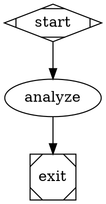
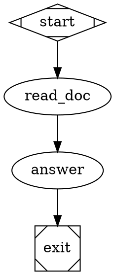
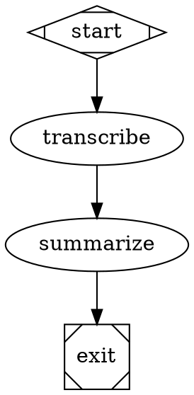

# Subagent Delegation: SA-005 - Multi-Modal Support

## Task Summary
Extend Factorial to support multi-modal content (images, audio, documents) in LLM interactions. Enable workflows that can analyze images, process audio, and read documents.

## Scope

### In Scope
- Extend ContentPart types with ImageData, AudioData, DocumentData
- Update Message type to support multimodal content lists
- Implement file loading utilities for each media type
- Update all provider adapters (OpenAI, Anthropic, Gemini) to convert multi-modal content
- Add node attributes for multi-modal input (image_input, audio_input, document_input)
- Update artifact system to preserve binary data references
- Support for common formats: PNG, JPEG, GIF, WEBP, PDF, WAV, MP3

### Out of Scope
- Video processing (too complex for initial implementation)
- Real-time audio streaming (WebRTC, etc.)
- Provider profiles (SA-001)
- Reasoning extraction (SA-002)
- Anthropic caching (SA-003)
- Subagent tools (SA-004)

## Background Context

Current Factorial only supports **text content**. Modern LLMs are increasingly multi-modal:
- **GPT-4o/Vision**: Analyzes images, generates descriptions
- **Claude 3**: Processes images, documents (PDFs)
- **Gemini**: Handles images, audio, video

Per unified-llm spec Section 3.5:
- ImageData: url or base64 data with media_type
- AudioData: url or base64 data with media_type  
- DocumentData: url or base64 data with media_type and optional file_name

Each provider has different API requirements for multi-modal content.

## Deliverables

### 1. Extended Type Definitions

Update `packages/core/src/types/index.ts`:

```typescript
// Existing ContentKind enum - add new types
export enum ContentKind {
  TEXT = 'TEXT',
  IMAGE = 'IMAGE',        // NEW
  AUDIO = 'AUDIO',        // NEW
  DOCUMENT = 'DOCUMENT',  // NEW
  TOOL_CALL = 'TOOL_CALL',
  TOOL_RESULT = 'TOOL_RESULT',
  THINKING = 'THINKING'
}

// Image data structure
export interface ImageData {
  url?: string;           // URL to image
  data?: Buffer;          // Raw image bytes
  media_type: 'image/png' | 'image/jpeg' | 'image/gif' | 'image/webp';
  detail?: 'auto' | 'low' | 'high';  // OpenAI-specific quality hint
}

// Audio data structure
export interface AudioData {
  url?: string;
  data?: Buffer;
  media_type: 'audio/wav' | 'audio/mp3' | 'audio/m4a' | 'audio/ogg';
}

// Document data structure
export interface DocumentData {
  url?: string;
  data?: Buffer;
  media_type: 'application/pdf' | 'text/plain' | 'text/markdown';
  file_name?: string;     // For display purposes
}

// Extended ContentPart
export interface ContentPart {
  kind: ContentKind;
  text?: string;
  image?: ImageData;       // Populated when kind == IMAGE
  audio?: AudioData;       // Populated when kind == AUDIO
  document?: DocumentData; // Populated when kind == DOCUMENT
  // ... existing fields
}

// Extended Message - now supports list of ContentParts
export interface Message {
  role: 'system' | 'user' | 'assistant' | 'tool';
  content: ContentPart[];  // Changed from string to array
  name?: string;
  tool_call_id?: string;
}

// Helper functions
export function createTextMessage(text: string): Message {
  return {
    role: 'user',
    content: [{ kind: ContentKind.TEXT, text }]
  };
}

export function createImageMessage(imagePath: string): Message {
  return {
    role: 'user',
    content: [{ 
      kind: ContentKind.IMAGE, 
      image: { url: imagePath, media_type: inferImageType(imagePath) }
    }]
  };
}

export function createMultimodalMessage(parts: ContentPart[]): Message {
  return {
    role: 'user',
    content: parts
  };
}
```

### 2. File Loading Utilities

Create `packages/core/src/multimodal/file-loader.ts`:

```typescript
import { readFile } from 'node:fs/promises';
import { extname } from 'node:path';
import type { ImageData, AudioData, DocumentData } from '../types/index.js';

export async function loadImage(path: string, detail?: 'auto' | 'low' | 'high'): Promise<ImageData> {
  const data = await readFile(path);
  const media_type = inferImageMediaType(path);
  
  return {
    data,
    media_type,
    detail: detail || 'auto'
  };
}

export async function loadAudio(path: string): Promise<AudioData> {
  const data = await readFile(path);
  const media_type = inferAudioMediaType(path);
  
  return {
    data,
    media_type
  };
}

export async function loadDocument(path: string): Promise<DocumentData> {
  const data = await readFile(path);
  const media_type = inferDocumentMediaType(path);
  
  return {
    data,
    media_type,
    file_name: path.split('/').pop()
  };
}

function inferImageMediaType(path: string): ImageData['media_type'] {
  const ext = extname(path).toLowerCase();
  switch (ext) {
    case '.png': return 'image/png';
    case '.jpg':
    case '.jpeg': return 'image/jpeg';
    case '.gif': return 'image/gif';
    case '.webp': return 'image/webp';
    default:
      throw new Error(`Unsupported image format: ${ext}. Use png, jpg, gif, or webp.`);
  }
}

function inferAudioMediaType(path: string): AudioData['media_type'] {
  const ext = extname(path).toLowerCase();
  switch (ext) {
    case '.wav': return 'audio/wav';
    case '.mp3': return 'audio/mp3';
    case '.m4a': return 'audio/m4a';
    case '.ogg': return 'audio/ogg';
    default:
      throw new Error(`Unsupported audio format: ${ext}. Use wav, mp3, m4a, or ogg.`);
  }
}

function inferDocumentMediaType(path: string): DocumentData['media_type'] {
  const ext = extname(path).toLowerCase();
  switch (ext) {
    case '.pdf': return 'application/pdf';
    case '.txt': return 'text/plain';
    case '.md': return 'text/markdown';
    default:
      throw new Error(`Unsupported document format: ${ext}. Use pdf, txt, or md.`);
  }
}

// Size validation
const MAX_IMAGE_SIZE = 20 * 1024 * 1024;  // 20MB
const MAX_AUDIO_SIZE = 50 * 1024 * 1024;  // 50MB
const MAX_DOCUMENT_SIZE = 32 * 1024 * 1024;  // 32MB

export function validateFileSize(data: Buffer, type: 'image' | 'audio' | 'document'): void {
  const limits = {
    image: MAX_IMAGE_SIZE,
    audio: MAX_AUDIO_SIZE,
    document: MAX_DOCUMENT_SIZE
  };
  
  if (data.length > limits[type]) {
    throw new Error(
      `${type} file too large: ${(data.length / 1024 / 1024).toFixed(2)}MB. ` +
      `Max: ${(limits[type] / 1024 / 1024)}MB`
    );
  }
}
```

### 3. Provider Adapter Updates

#### OpenAI Adapter

Update `packages/core/src/llm/index.ts` for OpenAI multi-modal:

```typescript
private convertToOpenAIMessage(message: Message): OpenAIMessage {
  return {
    role: this.mapRole(message.role),
    content: message.content.map(part => {
      if (part.kind === 'TEXT' && part.text) {
        return {
          type: 'text',
          text: part.text
        };
      }
      
      if (part.kind === 'IMAGE' && part.image) {
        return {
          type: 'image_url',
          image_url: {
            url: part.image.data
              ? `data:${part.image.media_type};base64,${part.image.data.toString('base64')}`
              : part.image.url!,
            detail: part.image.detail || 'auto'
          }
        };
      }
      
      // OpenAI doesn't support audio/documents in chat completions
      // Would need to use Assistants API or specialized endpoints
      throw new Error(`Content type ${part.kind} not supported by OpenAI chat completions`);
    })
  };
}
```

#### Anthropic Adapter

Update for Anthropic multi-modal (from SA-003):

```typescript
private convertToAnthropicMessage(message: Message): AnthropicMessage {
  const content: AnthropicContentBlock[] = message.content.map(part => {
    if (part.kind === 'TEXT' && part.text) {
      return {
        type: 'text',
        text: part.text
      };
    }
    
    if (part.kind === 'IMAGE' && part.image) {
      return {
        type: 'image',
        source: {
          type: 'base64',
          media_type: part.image.media_type,
          data: part.image.data?.toString('base64') || 
                Buffer.from(await fetch(part.image.url!).then(r => r.arrayBuffer())).toString('base64')
        }
      };
    }
    
    if (part.kind === 'DOCUMENT' && part.document) {
      // Anthropic supports PDFs via base64
      if (part.document.media_type === 'application/pdf') {
        return {
          type: 'document',
          source: {
            type: 'base64',
            media_type: 'application/pdf',
            data: part.document.data?.toString('base64') || 
                  Buffer.from(await fetch(part.document.url!).then(r => r.arrayBuffer())).toString('base64')
          }
        };
      }
      // Plain text documents can be converted to text blocks
      if (part.document.media_type === 'text/plain') {
        return {
          type: 'text',
          text: part.document.data?.toString() || 
                await fetch(part.document.url!).then(r => r.text())
        };
      }
    }
    
    throw new Error(`Content type ${part.kind} not supported by Anthropic`);
  });
  
  return {
    role: message.role === 'tool' ? 'user' : message.role,
    content
  };
}
```

#### Gemini Adapter

Update for Gemini multi-modal:

```typescript
private convertToGeminiMessage(message: Message): GeminiContent {
  const parts: GeminiPart[] = message.content.map(part => {
    if (part.kind === 'TEXT' && part.text) {
      return { text: part.text };
    }
    
    if (part.kind === 'IMAGE' && part.image) {
      return {
        inlineData: {
          mimeType: part.image.media_type,
          data: part.image.data?.toString('base64') ||
                Buffer.from(await fetch(part.image.url!).then(r => r.arrayBuffer())).toString('base64')
        }
      };
    }
    
    if (part.kind === 'AUDIO' && part.audio) {
      return {
        inlineData: {
          mimeType: part.audio.media_type,
          data: part.audio.data?.toString('base64') ||
                Buffer.from(await fetch(part.audio.url!).then(r => r.arrayBuffer())).toString('base64')
        }
      };
    }
    
    if (part.kind === 'DOCUMENT' && part.document) {
      return {
        inlineData: {
          mimeType: part.document.media_type,
          data: part.document.data?.toString('base64') ||
                Buffer.from(await fetch(part.document.url!).then(r => r.arrayBuffer())).toString('base64')
        }
      };
    }
    
    throw new Error(`Content type ${part.kind} not supported by Gemini`);
  });
  
  return {
    role: message.role === 'model' ? 'model' : 'user',
    parts
  };
}
```

### 4. CodergenHandler Multi-Modal Integration

Update `packages/core/src/handlers/builtin.ts`:

```typescript
// In CodergenHandler.execute()
async function buildMessages(node: Node, context: Context): Promise<Message[]> {
  const messages: Message[] = [];
  
  // Handle image input
  const imageInput = node.attributes.image_input as string | undefined;
  if (imageInput) {
    const imageData = await loadImage(imageInput);
    messages.push({
      role: 'user',
      content: [{
        kind: ContentKind.IMAGE,
        image: imageData
      }]
    });
  }
  
  // Handle audio input
  const audioInput = node.attributes.audio_input as string | undefined;
  if (audioInput) {
    const audioData = await loadAudio(audioInput);
    messages.push({
      role: 'user',
      content: [{
        kind: ContentKind.AUDIO,
        audio: audioData
      }]
    });
  }
  
  // Handle document input
  const documentInput = node.attributes.document_input as string | undefined;
  if (documentInput) {
    const documentData = await loadDocument(documentInput);
    messages.push({
      role: 'user',
      content: [{
        kind: ContentKind.DOCUMENT,
        document: documentData
      }]
    });
  }
  
  // Add text prompt
  const prompt = node.attributes.prompt as string;
  if (prompt) {
    messages.push({
      role: 'user',
      content: [{
        kind: ContentKind.TEXT,
        text: prompt
      }]
    });
  }
  
  // Combine consecutive user messages if needed
  return messages;
}
```

### 5. Artifact Preservation

Update artifact writing to handle binary data:

```typescript
// In CodergenHandler
async function writeMultimodalArtifacts(
  stageDir: string,
  messages: Message[]
): Promise<void> {
  for (let i = 0; i < messages.length; i++) {
    const msg = messages[i];
    
    for (let j = 0; j < msg.content.length; j++) {
      const part = msg.content[j];
      
      if (part.kind === 'IMAGE' && part.image?.data) {
        await writeFile(
          join(stageDir, `input_${i}_${j}.${part.image.media_type.split('/')[1]}`),
          part.image.data
        );
      }
      
      if (part.kind === 'AUDIO' && part.audio?.data) {
        await writeFile(
          join(stageDir, `input_${i}_${j}.${part.audio.media_type.split('/')[1]}`),
          part.audio.data
        );
      }
      
      if (part.kind === 'DOCUMENT' && part.document?.data) {
        const ext = part.document.media_type === 'application/pdf' ? 'pdf' : 'txt';
        await writeFile(
          join(stageDir, `input_${i}_${j}.${ext}`),
          part.document.data
        );
      }
    }
  }
}
```

### 6. Tests

Create `packages/core/src/multimodal/file-loader.test.ts`:

```typescript
describe('File Loader', () => {
  test('loads image file correctly', async () => {
    const image = await loadImage('fixtures/test.png');
    expect(image.media_type).toBe('image/png');
    expect(image.data).toBeInstanceOf(Buffer);
    expect(image.data.length).toBeGreaterThan(0);
  });

  test('rejects oversized image', async () => {
    const largeBuffer = Buffer.alloc(25 * 1024 * 1024);  // 25MB
    await expect(validateFileSize(largeBuffer, 'image'))
      .rejects.toThrow('image file too large');
  });

  test('infers correct media types', () => {
    expect(inferImageMediaType('photo.jpg')).toBe('image/jpeg');
    expect(inferImageMediaType('icon.png')).toBe('image/png');
    expect(inferAudioMediaType('sound.mp3')).toBe('audio/mp3');
    expect(inferDocumentMediaType('doc.pdf')).toBe('application/pdf');
  });
});
```

## Evidence Requirements

### Required Artifacts

1. **Multi-Modal Compatibility Matrix**
   - Location: `docs/metrics/reports/multimodal-compatibility-latest.json`
   - Schema:
     ```json
     {
       "report_version": "1.0",
       "content_types": {
         "image": {
           "openai": { "supported": true, "formats": ["png", "jpg", "gif", "webp"], "max_size": "20MB" },
           "anthropic": { "supported": true, "formats": ["png", "jpg", "gif", "webp"], "max_size": "5MB" },
           "gemini": { "supported": true, "formats": ["png", "jpg", "gif", "webp"], "max_size": "20MB" }
         },
         "audio": {
           "openai": { "supported": false, "note": "Use Whisper API separately" },
           "anthropic": { "supported": false },
           "gemini": { "supported": true, "formats": ["wav", "mp3", "m4a"], "max_size": "50MB" }
         },
         "document": {
           "openai": { "supported": false, "note": "Use Assistants API" },
           "anthropic": { "supported": true, "formats": ["pdf", "txt"], "max_size": "32MB" },
           "gemini": { "supported": true, "formats": ["pdf", "txt"], "max_size": "50MB" }
         }
       }
     }
     ```

## Edge Cases to Handle

1. **Unsupported Format**: User tries to use HEIC image
   - Solution: Clear error message with supported formats

2. **File Not Found**: Path to image doesn't exist
   - Solution: Fail node execution with descriptive error

3. **Network Fetch Failure**: URL-based image fails to download
   - Solution: Retry with exponential backoff, fail after 3 attempts

4. **Token Limit**: Image/document too large for context window
   - Solution: Warn user, suggest compression or downsampling

5. **Mixed Modality**: Provider supports some types but not others
   - Solution: Filter unsupported types, warn about omissions

## Validation Steps

```bash
# Run file loader tests
npm run test:run packages/core/src/multimodal/

# Test image workflow
npx factorial run --graph examples/image-analysis.dot --logs-root ./logs

# Verify artifacts created
ls logs/*/input_*.png

# Generate compatibility matrix
node scripts/generate-multimodal-compatibility-report.js

# Check matrix output
cat docs/metrics/reports/multimodal-compatibility-latest.json
```

## Example DOT Workflows

### Image Analysis



### Document Processing



### Audio Transcription



## Dependencies

- **SA-002 (Reasoning Tokens)**: Uses extended usage types for token tracking
- Can work in parallel with SA-001, SA-003, SA-004

## Success Criteria

1. [ ] ContentPart extended with ImageData, AudioData, DocumentData
2. [ ] File loading utilities for all three media types
3. [ ] All three provider adapters support images
4. [ ] Anthropic and Gemini adapters support documents
5. [ ] Gemini adapter supports audio
6. [ ] Node attributes for multi-modal input work end-to-end
7. [ ] Binary data preserved in artifacts
8. [ ] Tests verify file loading and format validation
9. [ ] Compatibility matrix published

## Handoff Checklist

When complete, hand off to:
- Integration subagent - Multi-modal support ready
- Documentation - Add multi-modal examples to README

Handoff artifacts:
- [ ] Type definitions extended
- [ ] File loader implemented
- [ ] All adapters updated
- [ ] Tests passing
- [ ] Example workflows working
- [ ] Compatibility matrix generated
