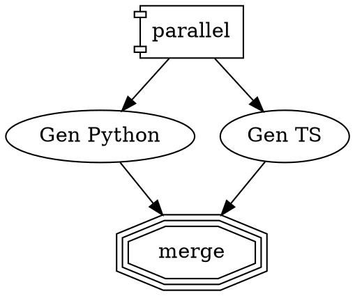

# Git Worktree Parallel Isolation - Implementation Summary

## Overview
Implemented git worktree isolation for parallel branches in Factorial workflows, enabling true filesystem isolation when parallel branches need to modify files independently.

## Files Changed

### New Files
- `packages/core/src/worktree/manager.ts` - WorktreeManager class for creating/merging/cleaning worktrees
- `packages/core/src/worktree/manager.test.ts` - Unit tests for WorktreeManager
- `packages/core/src/worktree/index.ts` - Module exports
- `docs/plans/git-worktree-parallel-isolation.md` - Implementation plan
- `tests/fixtures/worktree/parallel-worktree-example.dot` - Example workflow

### Modified Files
- `packages/core/src/engine/index.ts` - Added `cwd` support for branch engines
- `packages/core/src/handlers/builtin.ts` - Added worktree isolation to ParallelHandler and FanInHandler
- `packages/core/src/lint/index.ts` - Added WorktreeIsolationRule for linting worktree attributes
- `README.md` - Added documentation for worktree attributes and usage

## New DOT Attributes

### parallel (fan_out) nodes:
- `worktree_isolation` (boolean) - Enable git worktree isolation
- `worktree_base_path` (string) - Custom base path for worktrees
- `worktree_allow_dirty` (boolean) - Allow worktree creation with uncommitted changes

### parallel.fan_in nodes:
- `worktree_merge_strategy` (string) - Merge strategy: `fail`, `ours`, or `theirs`

## How It Works

1. **At fan_out**: When `worktree_isolation=true`, creates git worktrees for each branch from current HEAD
2. **During execution**: Each branch runs in its isolated worktree directory (set via `cwd`)
3. **At fan_in**: Worktrees are merged back using the specified strategy:
   - `fail`: Fail on conflicts (default)
   - `ours`: Accept main branch version
   - `theirs`: Accept worktree version
4. **Cleanup**: Worktrees are removed after successful merge

## Example Usage

## Verification

All checks pass:
- ✅ TypeScript compilation
- ✅ Biome linting
- ✅ All 186 tests (38 test files)
- ✅ New worktree manager tests (3 tests)

## Requirements

- Git >= 2.5 (for worktree support)
- Must run inside a git repository
- Clean working tree (unless `worktree_allow_dirty=true`)

## Safety Invariants (WT-001 through WT-005)

All invariants enforced:
- Worktrees always cleaned up (try/finally + abort handlers)
- Paths validated to stay within `.factorial/worktrees/`
- Safe git command execution (no shell injection)
- Atomic merge operations
- Context isolation preserved
