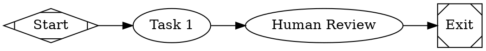
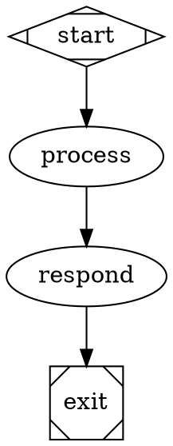
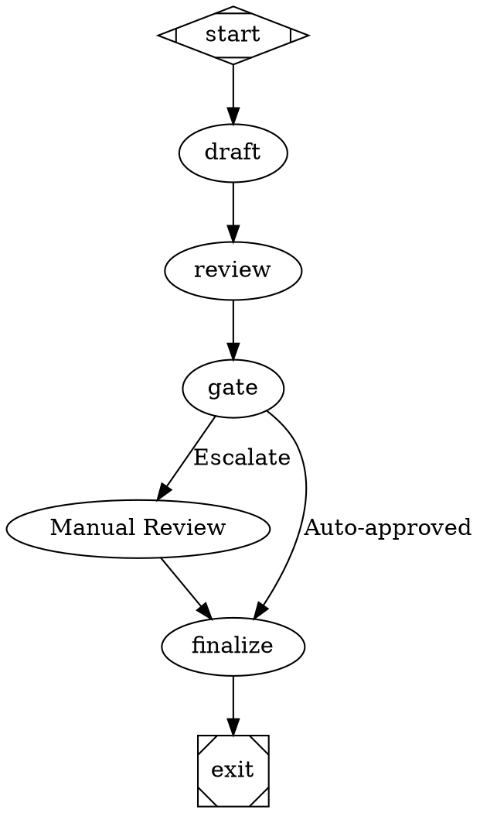
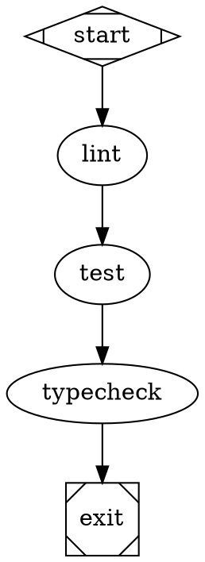
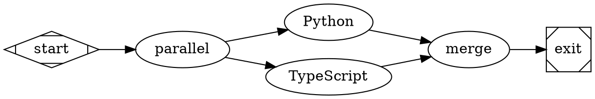
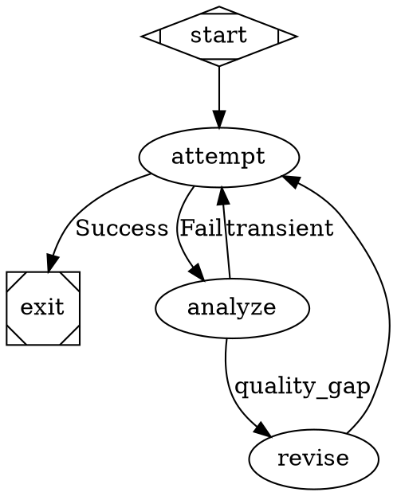

# Factorial Workflow Builder

Help users create valid DOT workflows for Factorial, a DOT-based orchestrator for multi-stage AI pipelines.

## When to Use This Skill

Use this skill when users:
- Want to create a new AI workflow
- Need to modify an existing DOT file
- Are getting validation errors
- Want to understand node types or attributes
- Need help with parallel execution, quality gates, or human-in-the-loop patterns

## Workflow Structure

Factorial workflows are directed graphs in DOT format:



## Node Types Reference

Use these shapes + types to create nodes:

| Shape | Type | Use When |
|-------|------|----------|
| `Mdiamond` | `start` | Entry point (required, exactly 1) |
| `box` | `codergen` (default) | LLM task, code generation |
| `hexagon` | `wait.human` | Need human approval/escalation |
| `diamond` | `conditional` | Branch based on condition expression |
| `diamond` | `confidence.gate` | Auto-approve vs escalate based on confidence |
| `component` | `parallel` | Fan-out to parallel branches |
| `tripleoctagon` | `parallel.fan_in` | Merge parallel branches |
| `box` | `quality.gate` | Run lint/tests/typecheck |
| `box` | `judge.rubric` | AI evaluation with scoring |
| `box` | `failure.analyze` | Classify failures for retry |
| `Msquare` | `exit` | Exit point (required, exactly 1) |

**Common Patterns:**
- `circle` shape is treated as `start`
- `doublecircle` shape is treated as `exit`
- `node_type` is accepted as alias for `type`

## Essential Node Attributes

### LLM Configuration (codergen nodes)
```dot
node [prompt="Instructions", llm_provider="openai", llm_model="gpt-4o-mini"]
```

**Per-node overrides:**
- `prompt`: Instructions for LLM (required for codergen)
- `llm_backend`: `api` or `cli`
- `llm_provider`: `openai`, `anthropic`, `google`, `github`
- `llm_model`: Provider-specific model name
- `output_contract_required`: `true` to require schema validation
- `output_schema`: Inline JSON schema
- `output_schema_path`: Path to schema file
- `output_mode`: `auto`, `json`, or `tool`

### Quality Gates
```dot
lint [type="quality.gate", gate_type="lint", gate_command="npm run lint"]
```

**Gate types:**
- `lint`: Code linting
- `tests`: Test suite
- `typecheck`: Type checking
- `security`: Security scanning
- `custom`: Arbitrary command

### Confidence-Based Routing
```dot
gate [type="confidence.gate",
      confidence_signal_path="judge.review.score",
      escalation_threshold=0.7,
      escalation_target="human_review"]
```

**Attributes:**
- `confidence_signal_path`: Context key with numeric value (0-1)
- `escalation_threshold`: Value below which to escalate
- `escalation_target`: Node ID for escalation

### AI Evaluation
```dot
review [type="judge.rubric",
        judge_rubric_path="./rubric.md",
        score_threshold=0.8,
        score_weights="{\"correctness\":0.5,\"style\":0.3}"]
```

**Rubric attributes:**
- `judge_rubric_path`: Path to rubric definition
- `score_threshold`: Minimum passing score
- `score_weights`: JSON object weighting dimensions

### Parallel Execution
```dot
parallel [type="parallel", worktree_isolation="true"]
merge [type="parallel.fan_in", merge_strategy="consensus"]
```

**Fan-in strategies:**
- `best_score`: Select highest scoring branch
- `consensus`: Require all branches agree
- `arbiter`: Use arbiter_prompt to decide

**Merge tie-breaks:**
- `weight`: Prefer higher weight edges
- `lexical`: Lexicographic ordering
- `latest`: Most recent branch

### Retry and Failure Handling
```dot
analyze [type="failure.analyze",
         retry_policy="targeted",
         retry_target_transient="lint",
         retry_target_quality_gap="review"]
```

**Retry policies:**
- `none`: No retry
- `standard`: Simple retry
- `targeted`: Route by failure class

### Budget and Timeouts
```dot
node [budget_max_tokens=4000,
      budget_max_cost_usd=0.50,
      timeout=30000,
      max_retries=3]
```

### CLI Backend
```dot
node [llm_backend="cli",
      cli_command="echo 'output'",
      cli_timeout_ms=5000]
```

## Graph-Level Attributes

Set in `graph [...]` block:

```dot
graph [goal="Workflow purpose",
       budget_max_tokens=10000,
       budget_max_cost_usd=5.00,
       budget_max_duration_ms=300000,
       promotion_stage="dev",
       quality_profile="baseline"]
```

**Promotion stages:**
- `dev`: Development (least strict)
- `canary`: Pre-production
- `prod`: Production (requires regulated profile)

**Quality profiles:**
- `baseline`: Basic validation
- `strict`: Requires codergen contracts + quality gates
- `regulated`: Requires non-custom gates + judge.rubric

## Edge Attributes

```dot
edge1 -> edge2 [label="Condition", condition="ctx.value > 5", weight=10]
```

- `label`: Human-readable description
- `condition`: Expression evaluated for routing
- `weight`: Edge priority (higher = preferred)
- `fidelity`: `compact` or `full`
- `thread_id`: Thread affinity for routing
- `loop_restart`: Create fresh run segment

## Common Workflow Patterns

### Pattern 1: Simple Linear Flow


### Pattern 2: Human-in-the-Loop


### Pattern 3: CI/CD Quality Pipeline


### Pattern 4: Parallel Code Generation


### Pattern 5: Retry with Failure Analysis


## Context Variables

Nodes can read/write context:
- `ctx.*`: Access context values
- Output of one node available to subsequent nodes
- Judge nodes set `judge.<node_id>.score` and `judge.<node_id>.passed`
- Failure analysis sets `failure.class` and `retry.class`

## Validation and Debugging

**Validate without running:**
```bash
npx factorial validate --graph workflow.dot --strict
```

**Visualize graph structure:**
```bash
npx factorial visualize --graph workflow.dot
```

**Common errors:**
- Missing `start` or `exit` nodes
- `codergen` nodes missing `prompt`
- LLM provider/model not configured
- `arbiter` strategy without `arbiter_prompt`
- Invalid DOT syntax (check braces, quotes)

## Configuration File

Create `config.json` for defaults:

```json
{
  "logs_root": "./logs",
  "llm_backend": "api",
  "default_provider": "openai",
  "llm_provider": "openai",
  "llm_model": "gpt-4o-mini",
  "providers": {
    "openai": {
      "api_key_env": "OPENAI_API_KEY",
      "default_model": "gpt-4o-mini"
    }
  },
  "checkpoint_interval": 1
}
```

## Environment Variables

Create `.env` file:
```bash
OPENAI_API_KEY=sk-...
ANTHROPIC_API_KEY=sk-...
GITHUB_TOKEN=ghp_...
```

## Best Practices

1. **Always set graph goal**: Helps with documentation
2. **Use descriptive labels**: Makes visualizations clearer
3. **Set promotion_stage and quality_profile**: Enforces standards
4. **Configure checkpoints**: Enable resume/replay
5. **Use confidence.gate for autonomy**: Balance automation and oversight
6. **Add quality.gate for production**: Lint, test, typecheck
7. **Set budget limits**: Prevent runaway costs
8. **Validate before committing**: Run `factorial validate`

## Examples Directory

See [assets/workflow-templates/](assets/workflow-templates/) for complete examples:
- `simple.dot` - Basic linear flow
- `code-review.dot` - AI + human review
- `ci-pipeline.dot` - Quality gates
- `parallel-generation.dot` - Worktree isolation
- `retry-loop.dot` - Failure analysis

## Resources

- [Node Types Reference](references/node-types.md)
- [Attributes Reference](references/attributes.md)
- Examples: [assets/workflow-templates/](assets/workflow-templates/)
- Factorial README: https://github.com/mhingston/factorial
